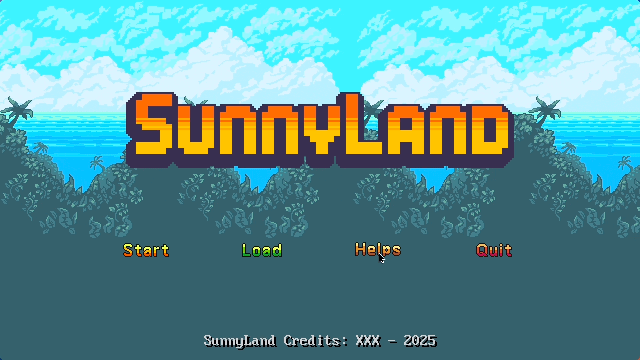
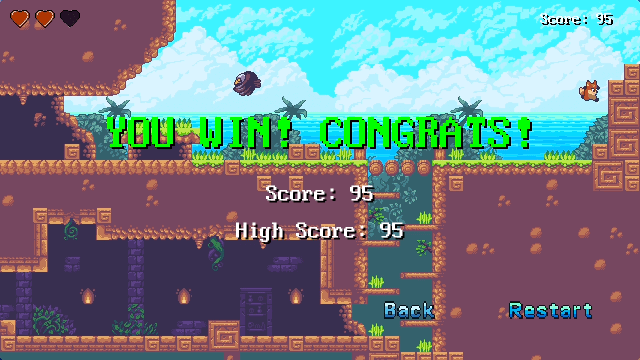
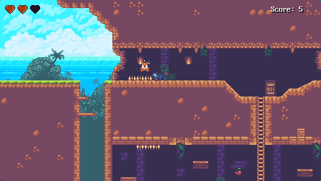

**本项目参照哔哩哔哩 up 主 ZiyuGameDev 老师的视频教程制作，原视频链接：https://www.bilibili.com/video/BV1u7NizLEBa?t=222.2**

**在此感谢ZiyuGameDev老师制作教学视频！！！**

## 控制

```
A,D / 左,右 - 移动;
W,S / 上,下 - 攀爬;
J / 空格 - 跳跃;
P / ESC - 显示菜单和暂停;
```

## 截图







## 第三方库

- [SDL3](https://github.com/libsdl-org/SDL)
- [SDL3_image](https://github.com/libsdl-org/SDL_image)
- [SDL3_mixer](https://github.com/libsdl-org/SDL_mixer)
- [SDL3_ttf](https://github.com/libsdl-org/SDL_ttf)
- [glm](https://github.com/g-truc/glm)
- [nlohmann-json](https://github.com/nlohmann/json)
- [spdlog](https://github.com/gabime/spdlog)

# 致谢


- 精灵
  - https://ansimuz.itch.io/sunny-land-pixel-game-art
- 特效
  - https://ansimuz.itch.io/sunny-land-pixel-game-art
- 字体
  - https://timothyqiu.itch.io/vonwaon-bitmap
- UI
  - https://markiro.itch.io/hud-asset-pack
  - https://bdragon1727.itch.io/platformer-ui-buttons
- 音效
  - https://taira-komori.jpn.org/
  - https://pixabay.com/sound-effects/dead-8bit-41400/
  - https://pixabay.com/sound-effects/cartoon-jump-6462/
  - https://pixabay.com/zh/sound-effects/frog-quak-81741/
  - https://mmvpm.itch.io/platformer-sound-fx-pack
  - https://kasse.itch.io/ui-buttons-sound-effects-pack
- 音乐
  - https://ansimuz.itch.io/sunny-land-pixel-game-art
- 赞助者: `sino`, `李同学`

# 再次向ZiyuGameDev老师表示感谢！