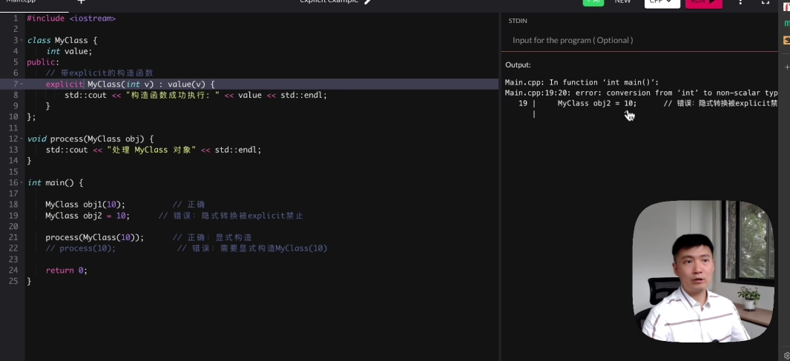
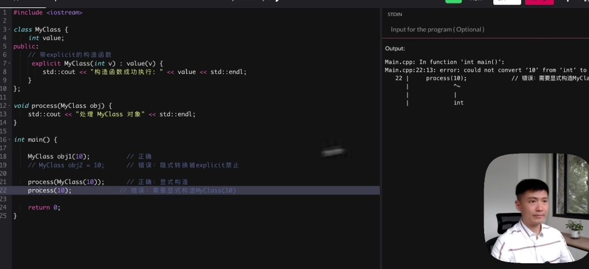

# 04：主循环与帧率控制

## 一个原则


## 智能指针

智能指针不可以复制或者拷贝，只可以移动，并且当对象析构函数被调用时会自动释放。


### 1. **`std::unique_ptr` - 只能移动，不能复制**

cpp

```c++
std::unique_ptr<int> p1(new int(10));
std::unique_ptr<int> p2 = p1;          // ❌ 编译错误！不能复制
std::unique_ptr<int> p3 = std::move(p1); // ✅ 可以移动
// 现在 p1 为空，p3 拥有资源
```


**设计原理：**

- **独占所有权**：同一时间只有一个 `unique_ptr` 可以指向某个资源
- **防止意外共享**：避免多个指针管理同一资源导致重复释放
- **明确的资源转移**：移动操作明确表示所有权转移

------

### 2. **`std::shared_ptr` - 可以复制和移动**

cpp

```c++
std::shared_ptr<int> p1(new int(10));
std::shared_ptr<int> p2 = p1;          // ✅ 可以复制，引用计数+1
std::shared_ptr<int> p3 = std::move(p1); // ✅ 可以移动，引用计数不变
// p1 为空，p2 和 p3 共享所有权
```


------

### 3. **`std::weak_ptr` - 只能从 shared_ptr 创建**

cpp

```c++
std::shared_ptr<int> sp(new int(10));
std::weak_ptr<int> wp = sp;  // ✅ 可以构造
```


### 为什么 unique_ptr 要禁止复制？

#### **核心原因：RAII（资源获取即初始化）原则**

cpp

```c++
{
    std::unique_ptr<File> file(openFile("data.txt"));
    // 文件在此作用域结束时自动关闭
    // 如果允许复制，两个指针离开作用域都会尝试关闭文件 → 双重释放！
}
```


#### **具体问题：**

1. **双重释放**：两个指针销毁时都会释放同一资源
2. **悬空指针**：一个指针释放资源，另一个指针变成野指针
3. **所有权模糊**：不清楚哪个指针负责释放资源


# 05：资源管理模块

### explicit关键字

在构造函数前加上explicit关键字可以防止隐式转化，对单一参数的构造函数有效





## 向前声明与智能指针

ResoureManager类内部的智能指针的类是通过向前声明的方式声明的，并没有引入对应类的源文件，但是**智能指针需要知道对应类的析构函数**，不引入头文件的情况下**找不到析构函数的完整定义**。


### 1. 不完整类型的问题

在头文件中：

```c++
class TextureManager;  // 向前声明，不完整类型
std::unique_ptr<TextureManager> texture_manager_;  // 包含不完整类型的unique_ptr
```

`TextureManager` 只是一个**向前声明**，编译器此时不知道：

- 它的大小
- 它的析构函数如何调用
- 它的内存布局

### 2. std::unique_ptr 的析构要求

`std::unique_ptr` 的默认删除器（`std::default_delete`）在析构时需要**完整的类型信息**来调用正确的 `delete` 操作。

当编译器在头文件中看到类定义时：

- 如果使用隐式生成的析构函数
- 编译器会尝试为每个成员生成析构代码
- 对于 `std::unique_ptr<TextureManager>`，需要知道 `TextureManager` 的完整定义
- 但此时只有向前声明，导致**编译错误**

### 3. 显式声明的必要性

通过显式声明析构函数：

```c++
~ResourceManager();  // 在头文件中声明
```

然后在实现文件（.cpp）中定义：

```c++
#include "TextureManager.h"  // 包含完整定义
#include "AudioManager.h"
#include "FontManager.h"

ResourceManager::~ResourceManager() = default;  // 或实现具体逻辑
```


### 4. 编译器的工作流程

#### 错误做法（隐式析构）：

```c++
class ResourceManager {
    std::unique_ptr<TextureManager> manager_;  // TextureManager不完整
    // 编译器尝试生成隐式析构函数 ❌
    // 需要TextureManager的完整定义，但找不到！
};
```


#### 正确做法（显式析构）：

```c++
// resource_manager.h
class ResourceManager {
    std::unique_ptr<TextureManager> manager_;
public:
    ~ResourceManager();  // 只是声明，不生成代码
};

// resource_manager.cpp
#include "texture_manager.h"  // 现在TextureManager完整了
ResourceManager::~ResourceManager() {
    // 这里可以安全地析构unique_ptr
    // 因为TextureManager已经是完整类型
}
```


### 5. 同样适用于其他特殊成员函数

这个原则也适用于：

- **拷贝构造函数**：需要显式声明并在实现文件中定义
- **拷贝赋值运算符**：需要显式声明并在实现文件中定义
- **移动构造函数和移动赋值运算符**：如果需要自定义，也需要类似处理

### 6. 为什么 unique_ptr 允许不完整类型？

`std::unique_ptr` 的设计允许使用**不完整类型**进行声明，但**必须在析构时看到完整类型**。这是它的一个特性：

- 可以在头文件中声明不完整类型的 unique_ptr
- 但必须在某个翻译单元中看到完整类型才能析构

### 总结

在这个代码中，`~ResourceManager()` 必须显式声明，因为：

1. 类包含不完整类型的 `std::unique_ptr` 成员
2. 编译器无法为这些成员生成正确的析构代码
3. 需要在实现文件中包含完整类型定义后再定义析构函数
4. 这避免了编译错误，同时保持了接口的简洁性

这是一个 C++ 中处理智能指针和 PIMPL（Pointer to IMPLementation）模式时的常见模式。


## 编译器的工作原理

### 1. **编译单元（Translation Unit）的概念**

- 每个 `.cpp` 文件是一个独立的编译单元
- 编译器**分别编译**每个 `.cpp` 文件，生成对应的 `.o` 目标文件
- 链接器最后将这些 `.o` 文件链接成可执行文件

### 2. **编译器只在自己的编译单元内搜索**

```c++
// resource_manager.h
class ResourceManager {
    std::unique_ptr<TextureManager> manager_;
public:
    ~ResourceManager();  // 声明
};

// === 编译单元 A ===
// main.cpp
#include "resource_manager.h"
int main() {
    ResourceManager rm;  // ✅ 编译通过，只知道声明
    // 不需要知道ResourceManager的析构实现
}

// === 编译单元 B ===
// resource_manager.cpp
#include "resource_manager.h"
#include "texture_manager.h"  // TextureManager的完整定义在这里！

ResourceManager::~ResourceManager() {
    // 编译器在这里才需要知道TextureManager的完整定义
    // 因为这里要生成析构代码
}
```


### 3. **分离编译的关键点**

```
头文件（.h）只包含声明：
- 告诉编译器："有这个东西，但细节在其他地方"

实现文件（.cpp）包含定义：
- 告诉编译器："这是具体的实现细节"

编译器的工作流程：
1. 编译main.cpp时：
   - 看到ResourceManager的声明
   - 看到~ResourceManager()的声明
   - 不生成析构代码（因为没有定义）
   - 只是记录"这个函数在其他地方定义"

2. 编译resource_manager.cpp时：
   - 包含了texture_manager.h
   - TextureManager现在是完整类型
   - 编译器可以生成~ResourceManager()的具体代码
   - 包括如何删除std::unique_ptr<TextureManager>
```


### 4. **为什么这不会出错？**

```c++
// 情景分析：

// 编译resource_manager.cpp时：
#include "texture_manager.h"  // 1. 先包含完整定义
#include "resource_manager.h"  // 2. 再包含类声明

ResourceManager::~ResourceManager() {
    // 3. 编译器看到这里时：
    //    - 已经知道TextureManager是什么
    //    - 知道std::unique_ptr<TextureManager>如何析构
    //    - 可以生成正确的delete调用
}

// 链接时：
// 链接器将各个.o文件合并
// main.o中未解析的~ResourceManager()符号
// 在resource_manager.o中找到实现
```


### 5. **编译错误会发生在哪里？**

cpp

```c++
// 错误示例1：在头文件中定义析构函数
// resource_manager.h
class ResourceManager {
    std::unique_ptr<TextureManager> manager_;
public:
    ~ResourceManager() {}  // ❌ 编译错误！
    // 编译器处理这个头文件时，TextureManager不完整
};

// 错误示例2：实现文件中忘记包含完整定义
// resource_manager.cpp
#include "resource_manager.h"
// 忘记包含texture_manager.h！

ResourceManager::~ResourceManager() {
    // ❌ 编译错误！
    // 编译器不知道TextureManager的完整定义
    // 无法生成正确的析构代码
}
```


### 6. **可视化编译过程**

text

```
编译阶段：
main.cpp ──编译──→ main.o
    ↑              (需要~ResourceManager()的调用地址)
    │
包含头文件
    │
resource_manager.cpp ──编译──→ resource_manager.o
    ↑ 包含完整定义        (包含~ResourceManager()的实现代码)
    │
texture_manager.h

链接阶段：
main.o + resource_manager.o ──链接──→ 可执行文件
         ↳ 提供~ResourceManager()的实现
```


### 7. **关键区别：声明 vs 定义**

cpp

```c++
// 声明（Declaration）：
// 告诉编译器"这个函数存在"
~ResourceManager();

// 定义（Definition）：
// 告诉编译器"这个函数的实现是这样"
ResourceManager::~ResourceManager() {
    // 具体实现
}
```


### 8. **模板类的情况对比**

cpp

```c++
// unique_ptr是模板类，但它的析构器需要完整类型
template<typename T>
class unique_ptr {
    T* ptr;
public:
    ~unique_ptr() { delete ptr; }  // 这里需要T的完整类型！
    // 编译器必须知道如何delete一个T
};
```


### 总结

1. **编译器不会"搜索"实现文件**，而是**编译时处理每个.cpp文件**
2. **头文件被包含到.cpp文件中一起编译**
3. 在 `resource_manager.cpp` 中：
   - 包含了 `texture_manager.h`（完整定义）
   - 定义了 `~ResourceManager()`
   - 编译器看到完整类型，可以生成析构代码
4. 在其他文件中：
   - 只包含头文件，看到声明
   - 不生成析构代码，只生成调用
   - 实际地址由链接器解析

这种设计是 C++ 分离接口和实现的核心机制，允许：

- 接口（头文件）简洁，不暴露实现细节
- 实现（.cpp文件）可以自由修改而不影响其他文件
- 减少编译依赖，提高编译速度


## 自定义智能指针的删除方式

当智能指针的类型没有智能删除方法时（比如SDL_Texture)，如果要智能指针可以自动删除，就需要手动定义一个删除器，和该类型一起传入智能指针的参数。


## 哈希


```c++
	//定义字体键路径和大小
    using FontKey = std::pair<std::string, int>;

    //FontKey 的自定义哈希函数,这样之后就可以调用FontKeyHash(FontKey& key)了
    struct FontKeyHash
    {
        std::size_t operator()(const FontKey& key) const
        {
            std::hash<std::string> string_hasher;
            std::hash<int> int_hasher;
            return string_hasher(key.first) ^ int_hasher(key.second);       //最常见的合并hash值的方法，按位异或
        }
    };

    /**
     * @brief 管理 SDL_ttf 字体资源（TTF_Font）。
     *
     * 提供字体的加载和缓存功能，通过文件路径和点大小来标识。
     * 构造失败会抛出异常。仅供 ResourceManager 内部使用。
     */
    class FontManager
    {
        friend class ResourceManager;

    private:
        //TTF_Font的自定义删除器
        struct SDLFontDeleter
        {
            void operator()(TTF_Font* font) const 
            {
                if (font)
                {
                    TTF_CloseFont(font);
                }
            }
        };


        //字体存储器
        //unorder_map的键需要可以转化为哈希值，并且如果时基础数据类型，系统会自动转化
        //如果是自定义类型，系统无法自动转化，则需要传入第三个模板参数，该参数要记载将键转化为哈希值的逻辑
        std::unordered_map<FontKey, std::unique_ptr<TTF_Font, SDLFontDeleter>, FontKeyHash> fonts_;

```


# 06渲染器相机与精灵

## std::optional


## 视差滚动效果原理

### 🧠 核心原理：抽象出“相机”

在没有引擎时，你首先要建立一个核心概念：**“相机”**。屏幕只是一个窗口，你看到的所有物体都存在于一个更大的“世界坐标系”中。相机的任务，就是决定将世界的哪一部分映射到屏幕这个窗口上。

滚动（或卷轴）的本质，就是**相机在世界坐标系中的移动**。

### 📝 实现步骤与方法

我们将通过以下步骤，从零构建一个基础的滚动系统：

#### 第1步：建立坐标系与相机模型

首先定义你的数据结构：

- **世界坐标 (World Position)**：游戏中所有物体（精灵、背景块）的绝对位置。
- **相机 (Camera)**：一个至少包含 `x` 和 `y` 坐标（表示其世界位置）的对象。它可能还包含 `width` 和 `height`（表示视口大小）。

**关键公式**：一个物体要出现在屏幕上，其屏幕坐标计算公式为：
`屏幕坐标 = 物体世界坐标 - 相机坐标`

例如，相机位于 `(100, 50)`，一个树的世界坐标是 `(150, 80)`，那么它在屏幕上的绘制位置就是 `(50, 30)`。当相机向右移动，物体的屏幕坐标就会减小，产生向左滚动的视觉效果。

#### 第2步：构建游戏循环与绘制管线

在游戏的主循环中，你必须遵循以下顺序：

1. **处理输入**：根据键盘、鼠标输入，更新相机的 `x` 或 `y` 坐标。
2. **更新逻辑**：基于相机新位置，计算所有需要渲染物体的屏幕坐标。
3. **绘制**：**按照从远到近的顺序**，将每个物体绘制在其计算出的屏幕坐标上，后绘制的物体会覆盖先绘制的，从而正确模拟深度。

#### 第3步：实现视差滚动层

在基础相机模型上，通过为不同图层引入不同的**移动速度因子**来实现视差。

**实现方法**：

1. 将背景元素按视觉远近分层（如星空层、远山层、近树层）。
2. 为每一层定义一个 `parallax_factor`（视差因子），通常 `0.0` 到 `1.0` 之间。`0` 表示完全静止（无限远），`1` 表示与相机完全同速（和玩家同层），`0.5` 表示相机移动100像素，该层只移动50像素。
3. **修改屏幕坐标计算公式**：
   `某层物体的屏幕坐标 = 物体世界坐标 - (相机坐标 * 该层的视差因子)`
   注意：这里的“物体世界坐标”对于背景图而言，通常就是其本身的放置位置。

**一个简单的三层背景伪代码示例**：

javascript

```c++
// 假设相机位置 camera_x = 200
let layers = [
  {img: sky_img,   x: 0, factor: 0.0}, // 远景，因子为0，静止
  {img: hills_img, x: 0, factor: 0.3}, // 中景，移动缓慢
  {img: trees_img, x: 0, factor: 0.6}  // 近景，移动较快
];

function draw() {
  for (let layer of layers) {
    // 计算该层的屏幕位置
    let screen_x = layer.x - (camera_x * layer.factor);
    // 在 screen_x 处绘制 layer.img
    drawImage(layer.img, screen_x, 0);
  }
  // ... 然后绘制与相机同速的游戏角色和物体 (factor = 1.0)
}
```


#### 第4步：关键优化技术

1. **循环/无限背景**：
   对于会移动的背景层，当其一部分完全移出屏幕时，需要“回收”它。常用技巧是绘制**两张相同的背景图首尾相连**。当第一张图完全移出屏幕时，立即将其位置重置到第二张图的末尾，形成无缝循环。
2. **脏矩形渲染**：
   这是无引擎开发中提升性能的关键。不要每帧都重绘整个屏幕。只重绘那些内容发生变化的屏幕区域（“脏矩形”），可以极大减少绘制调用。
3. **纹理/精灵批处理**：
   将多个小图片（精灵）合并到一张大图集（Texture Atlas）中。绘制时，通过指定大图集中的坐标矩形来绘制小图。这能减少GPU绘制状态的切换，显著提升性能。


### 移动速度和图片大小的关系

更准确的说法是：**在相同关卡长度下，移动速度越慢的图层（远景），其图片所需的“逻辑宽度”越小；移动速度越快的图层（近景），其图片所需的“逻辑宽度”越大。（当然这里的快慢是相对于屏幕而言的，如果相对于整个世界坐标，则是远景移动最快）**

下面我为你拆解其原理、计算方法和实现技巧。

#### 🧮 核心原理与计算公式

**核心逻辑**：所有图层需要陪伴相机走完相同的 **“关卡总长度”**。由于它们移动速度不同，要“坚持”同样长的游戏时间，它们各自需要的“素材长度”也不同。

**定义**：

- `关卡长度 (L)`：你的相机从关卡起点到终点需要移动的总像素距离（例如 `3000px`）。
- `视差因子 (P)`：该图层的滚动速度因子（例如远景 `0.2`， 近景 `1.0`）。
- `图层所需逻辑宽度 (W)`：该图层的图片需要多宽（在世界坐标系中），才能保证在相机移动 `L` 距离内不会“穿帮”。

**计算公式**：
`图层所需逻辑宽度 (W) = 关卡长度 (L) * 视差因子 (P)`

#### 📐 举例说明

假设你的关卡长度 `L = 3000px`，你有三层：

1. **远景层**（山，因子 `P=0.2`）：
   `W_far = 3000 * 0.2 = 600px`
   这意味着，你只需要一张 **600px宽** 的山景图片，当相机移动3000px时，它在屏幕上只缓慢移动了600px，刚好够用。
2. **中景层**（树林，因子 `P=0.6`）：
   `W_mid = 3000 * 0.6 = 1800px`
   你需要一张 **1800px宽** 的树林图片。
3. **近景层**（灌木，因子 `P=1.0`）：
   `W_near = 3000 * 1.0 = 3000px`
   你需要一张 **3000px宽** 的灌木图片，才能与相机同速并覆盖整个关卡。

#### 🖼️ 实现方法与技巧

1. **图片实际制作**：
   你不需要真的制作一张3000px宽的巨型图片。通常采用 **“无缝拼接图”**。只要图片左右边缘能完美衔接，你就可以在代码中让它**重复绘制**，直到铺满计算出的“逻辑宽度”。

   - **例如**：近景层需要3000px，你可以制作一张600px宽的无缝灌木图，在代码中水平重复绘制5次。

2. **代码中的关键实现**：
   在每一帧绘制时，你需要用 **取模运算** 来实现循环滚动，并设置一个 **滚动上限**。

   ```c++
   // 伪代码示例：绘制一个可循环的图层
   function drawLayer(layerImage, parallaxFactor) {
       // 1. 计算该图层由于相机移动而产生的“世界偏移量”
       let layerOffset = cameraX * parallaxFactor;
   
       // 2. 关键：如果图层需要循环，对单张图片宽度取模
       let singleImageWidth = 600; // 你的无缝图片实际宽度
       let effectiveOffset = layerOffset % singleImageWidth;
   
       // 3. 绘制至少两张图片以覆盖屏幕（处理模运算后的缝隙）
       // 第一张（可能部分在屏幕外）
       drawImage(layerImage, -effectiveOffset, 0);
       // 第二张（紧接第一张右侧）
       drawImage(layerImage, singleImageWidth - effectiveOffset, 0);
   
       // 4. 判断是否到达尽头：如果 layerOffset >= 所需逻辑宽度 (W)，则停止滚动
       if (layerOffset >= L * parallaxFactor) {
           // 通常让最后一帧图片停留在屏幕上，不再更新位置
           return;
       }
   }
   ```

   

3. **同步尽头的判断**：
   在你的主更新逻辑中，判断关卡结束的条件是 **`cameraX >= 关卡长度L`**。当相机到达尽头，所有图层会根据公式自动停止在正确的位置，因为它们各自的 `layerOffset` 也都达到了 `L * P` 的最大值。

#### 💎 总结与表格对比

| 图层类型                 | 视差因子 (P)    | 相对于相机的速度 | 所需逻辑宽度 (W)      | 直观感受                                     |
| :----------------------- | :-------------- | :--------------- | :-------------------- | :------------------------------------------- |
| **远景层**（天空、远山） | 小 (如 0.0-0.3) | 慢               | **小**                | 移动缓慢，感觉遥远，一小段图片就能用很久。   |
| **中景层**（建筑、树林） | 中 (如 0.4-0.7) | 中等             | **中**                | 移动速度适中，需要较宽的图片内容。           |
| **近景层**（灌木、道路） | 大 (如 0.8-1.0) | 快               | **大**（等于或接近L） | 移动飞快，需要大量、宽广的素材才能覆盖全程。 |

**核心结论**：为了让所有图层在**同一游戏进度**（同一相机位置）下开始和结束，**近景层需要最宽、最丰富的图片内容来覆盖其快速移动造成的巨大视觉变化，而远景层则只需要较窄的图片内容**。这正是你在实践中需要规划和制作资源的关键依据。

如果你的关卡是**无限循环**的，那么逻辑就完全不同了——所有图层都需要无缝循环，没有“尽头”概念。你需要根据你想要的游戏类型来决定采用哪种设计。


# 07读取保存配置文件

## 当需要向前声明的类是别名时

json和nlohman_json两个类的定义如下图


就不可以使用传统class json;和class nolhman_json;的方法向前声明

```c++
#pragma once
#include <string>
#include <vector>
#include <unordered_map>


#include <nlohmann/json_fwd.hpp>        //提供前向声明，相当于class json;和class nolhman_json;
//因为json和nolhman_json两个类是别名而不是真正的名字，所以要引入官方给的头文件来使得可以做到和我们使用前向声明一样的效果


namespace engine::core
{
    


    class Config final
    {

        

    private:
        void fromJson(const nlohmann::json& j);
        nlohmann::ordered_json toJson() const;

    };

}
```


## json的get<T>()函数

## 基本作用

cpp

```c++
// 将 JSON 数据转换为指定类型
auto value = json_obj.get<T>();
```


## 你的例子解析

cpp

```c++
auto input_mappings = mappings_json.get<std::unordered_map<std::string, std::vector<std::string>>>();
```


这行代码的作用：

1. **类型转换**：将 `mappings_json`（nlohmann::json 对象）转换成一个 C++ 的 `unordered_map`
2. **键值类型**：
   - Key：`std::string`
   - Value：`std::vector<std::string>`
3. **自动推导**：使用 `auto` 让编译器自动推导返回类型

## 对应的 JSON 结构

你的代码期望的 JSON 结构应该是这样的：

json

```json
{
  "key1": ["value1", "value2"],
  "key2": ["value3"],
  "key3": ["value4", "value5", "value6"]
}
```


## 其他常用用法

```c++
// 1. 基本类型转换
int num = json_obj.get<int>();
double d = json_obj.get<double>();
std::string str = json_obj.get<std::string>();
bool flag = json_obj.get<bool>();

// 2. 数组转换
std::vector<int> vec = json_obj.get<std::vector<int>>();

// 3. 对象转换
std::map<std::string, int> map = json_obj.get<std::map<std::string, int>>();

// 4. 可选获取（避免异常）
auto value = json_obj.get<std::optional<int>>();
```


## 替代方法对比

cpp

```c++
// 使用 get() - 类型安全的显式转换
auto map = json_obj.get<std::unordered_map<std::string, std::vector<std::string>>>();

// 使用 get_to() - 传入已有变量
std::unordered_map<std::string, std::vector<std::string>> map;
json_obj.get_to(map);

// 使用 运算符= 隐式转换（需要类型匹配）
std::unordered_map<std::string, std::vector<std::string>> map = json_obj;
```


## 错误处理

`get()` 在类型不匹配时会抛出异常：

```c++
try {
    auto map = json_obj.get<std::unordered_map<std::string, std::vector<std::string>>>();
} catch (const nlohmann::json::type_error& e) {
    std::cerr << "类型错误: " << e.what() << std::endl;
}
```


## 总结

`get()` 的主要优势：

- **类型安全**：编译时类型检查
- **直接转换**：一步到位转换为目标类型
- **支持复杂类型**：可以转换嵌套的容器类型
- **异常安全**：类型不匹配时有明确的错误信息


## **std::move() 函数详解**

## **基本定义**

`std::move()` 是 C++11 引入的标准库函数，定义在 `<utility>` 头文件中。它的核心作用是**将左值转换为右值引用**，从而允许编译器调用移动语义（移动构造函数或移动赋值运算符）而非拷贝语义，达到减少不必要的资源拷贝、提升性能的目的。

## **本质与原理**

`std::move()` **并不真正"移动"任何数据**，它只是一个类型转换工具：

```c++
template <typename T>
typename remove_reference<T>::type&& move(T&& t) noexcept {
    return static_cast<typename remove_reference<T>::type&&>(t);
}
```

这个函数本质上是通过 `static_cast` 将传入的参数转换为对应的右值引用类型，使编译器能够将左值视为右值，从而触发移动语义。

## **作用与优势**

1. **避免深拷贝**：在处理大对象（如 `std::string`、`std::vector`）时，移动语义可以避免资源的深拷贝，直接转移资源所有权。
2. **提升性能**：移动操作通常只需要转移指针和重置原对象的状态，而拷贝操作需要分配新内存并复制内容，性能差异显著。
3. **资源高效管理**：对于包含动态内存的对象，移动操作可以避免不必要的内存分配和复制。

## **使用场景**

### **1. 触发移动构造函数**

```c++
std::string src = "Hello, World!";
std::string dest = std::move(src); // 移动构造，src的资源转移到dest
// 此时src可能为空，不再拥有原始数据
```

### **2. 容器操作中避免拷贝**

```c++
std::vector<std::string> vec;
std::string temp = "temporary string";
vec.push_back(std::move(temp)); // 触发移动构造，避免拷贝大字符串
// temp现在处于有效但未指定状态
```

### **3. 函数返回值优化**

```c++
std::string generateMessage() {
    std::string msg = "This is a long message...";
    return std::move(msg); // 显式触发移动，避免拷贝
}
```

> 注意：C++17 起编译器会自动进行 RVO（返回值优化），`std::move` 可能反而阻止优化，需谨慎使用。

### **4. 类成员的移动赋值/构造**

```c++
class MyClass {
    std::string data;
public:
    MyClass(std::string&& str) : data(std::move(str)) { }
    // ...
};
```

## **重要注意事项**

1. **移动后对象状态**：
   - 被 `std::move` 的对象之后不能再被正常使用
   - 原对象处于"合法但未指定状态"（通常为置空状态，如 `std::string` 变为空字符串）
   - 不应再依赖其值，只能被销毁或重新赋值
2. **`std::move` 不等于移动**：
   - `std::move` 只是类型转换，是否执行移动取决于对象类型是否支持移动构造/赋值
   - 例如：`void foo(std::string&& s) { ... }`，即使传入 `std::move(str)`，只有在 `foo` 内部使用移动操作，才会真正移动
3. **基本类型**：
   - 对于基本类型（int、float等），`std::move` 等同于拷贝，因为它们没有移动语义
4. **const 对象**：
   - 不能对 `const` 对象使用 `std::move`，因为 `const` 会阻止资源转移

## **与拷贝的对比**

表格


| 操作        | 描述               | 性能           | 典型使用         |
| :---------- | :----------------- | :------------- | :--------------- |
| 拷贝构造    | `T(const T&)`      | 慢（深拷贝）   | 用于值语义       |
| 移动构造    | `T(T&&)`           | 快（资源转移） | 优化临时对象传递 |
| `std::move` | 类型转换为右值引用 | 快             | 搭配移动构造使用 |

## **总结**

`std::move()` 是 C++11 引入的关键特性，它通过类型转换启用移动语义，使程序能够避免不必要的资源拷贝，提高性能。理解 `std::move` 的本质（类型转换工具而非移动操作）和正确使用场景，对于编写高性能 C++ 代码至关重要。

> **关键点**：`std::move` 的真正含义是"我承诺，在 `std::move` 之后，除了对源对象进行析构或重新赋值外，我不再使用它的当前值。" 这是一个程序员对编译器做出的承诺，违背此承诺会导致未定义行为。


## SDL设置垂直同步的方法

```c++
// 设置 VSync (注意: VSync 开启时，驱动程序会尝试将帧率限制到显示器刷新率，有可能会覆盖我们手动设置的 target_fps)
    int vsync_mode = config_->vsync_enabled_ ? SDL_RENDERER_VSYNC_ADAPTIVE : SDL_RENDERER_VSYNC_DISABLED;
    SDL_SetRenderVSync(sdl_renderer_, vsync_mode);
    spdlog::trace("VSync 设置为: {}", config_->vsync_enabled_ ? "Enabled" : "Disabled");
```

