# 04：主循环与帧率控制

## 一个原则

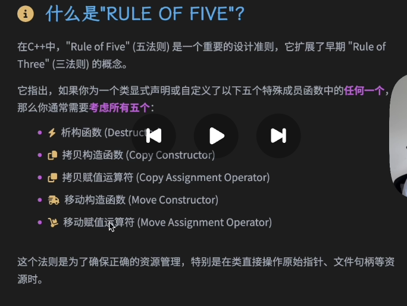

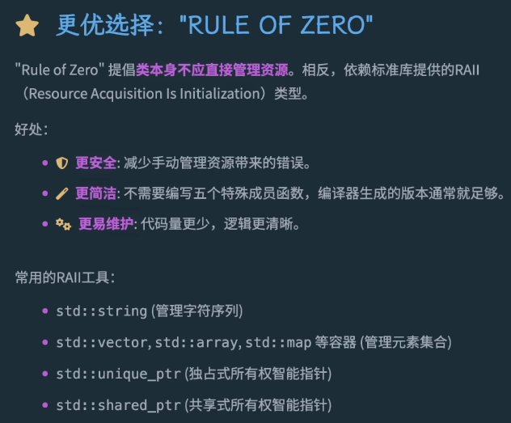

## 智能指针

智能指针不可以复制或者拷贝，只可以移动，并且当对象析构函数被调用时会自动释放。

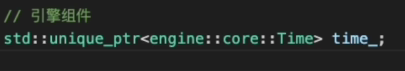

### 1. **`std::unique_ptr` - 只能移动，不能复制**

cpp

```c++
std::unique_ptr<int> p1(new int(10));
std::unique_ptr<int> p2 = p1;          // ❌ 编译错误！不能复制
std::unique_ptr<int> p3 = std::move(p1); // ✅ 可以移动
// 现在 p1 为空，p3 拥有资源
```


**设计原理：**

- **独占所有权**：同一时间只有一个 `unique_ptr` 可以指向某个资源
- **防止意外共享**：避免多个指针管理同一资源导致重复释放
- **明确的资源转移**：移动操作明确表示所有权转移

------

### 2. **`std::shared_ptr` - 可以复制和移动**

cpp

```c++
std::shared_ptr<int> p1(new int(10));
std::shared_ptr<int> p2 = p1;          // ✅ 可以复制，引用计数+1
std::shared_ptr<int> p3 = std::move(p1); // ✅ 可以移动，引用计数不变
// p1 为空，p2 和 p3 共享所有权
```


------

### 3. **`std::weak_ptr` - 只能从 shared_ptr 创建**

cpp

```c++
std::shared_ptr<int> sp(new int(10));
std::weak_ptr<int> wp = sp;  // ✅ 可以构造
```


### 为什么 unique_ptr 要禁止复制？

#### **核心原因：RAII（资源获取即初始化）原则**

cpp

```c++
{
    std::unique_ptr<File> file(openFile("data.txt"));
    // 文件在此作用域结束时自动关闭
    // 如果允许复制，两个指针离开作用域都会尝试关闭文件 → 双重释放！
}
```


#### **具体问题：**

1. **双重释放**：两个指针销毁时都会释放同一资源
2. **悬空指针**：一个指针释放资源，另一个指针变成野指针
3. **所有权模糊**：不清楚哪个指针负责释放资源


# 05：资源管理模块

## explicit关键字

在构造函数前加上explicit关键字可以防止隐式转化，对单一参数的构造函数有效

### 主要作用

#### 1. **单参数构造函数的隐式转换**

```c++
class String {
private:
    char* data;
    int size;
public:
    // 没有 explicit：允许隐式转换
    String(int length) {
        size = length;
        data = new char[size + 1];
        // ... 初始化
    }
    
    // 有 explicit：禁止隐式转换
    explicit String(const char* str) {
        // ... 实现
    }
};

void printString(const String& s) {
    // 打印字符串
}

int main() {
    String s1 = 10;       // ✅ 允许：隐式调用 String(10)
    String s2 = "hello";  // ❌ 错误：因为有 explicit，不能隐式转换
    
    String s3("hello");   // ✅ 正确：显式构造
    String s4 = String("hello"); // ✅ 正确：显式构造
    
    printString(10);      // ✅ 允许：隐式转换
    printString("hello"); // ❌ 错误：因为有 explicit
    printString(String("hello")); // ✅ 正确：显式转换
}
```

#### 2. **多参数构造函数的隐式转换**（C++11 开始）

```c++
class Point {
private:
    int x, y;
public:
    // C++11：多参数构造函数也可以使用 explicit
    explicit Point(int x, int y) : x(x), y(y) {}
};

void drawPoint(Point p) {
    // 绘制点
}

int main() {
    // Point p = {10, 20};  // ❌ 错误：因为有 explicit
    Point p(10, 20);        // ✅ 正确：显式构造
    // drawPoint({10, 20}); // ❌ 错误：不能隐式转换
    drawPoint(Point(10, 20)); // ✅ 正确：显式转换
}
```

#### 3. **转换操作符的隐式转换**（C++11 开始）

```c++
class SmartBool {
private:
    bool value;
public:
    explicit operator bool() const {
        return value;
    }
};

int main() {
    SmartBool sb;
    
    // if (sb) {            // ✅ C++11：允许在条件语句中隐式转换
    //     // ...
    // }
    
    // bool b = sb;         // ❌ 错误：不能隐式转换为 bool
    bool b = static_cast<bool>(sb);  // ✅ 正确：显式转换
    
    // int x = sb ? 1 : 0;  // ✅ 正确：条件表达式允许
}
```


### 为什么要使用 explicit

#### 优点：

1. ##### **避免意外的类型转换**

   ```c++
   class Buffer {
   public:
       Buffer(int size) { /* 分配内存 */ }
       ~Buffer() { /* 释放内存 */ }
   };
   
   void processBuffer(Buffer buf) {
       // 处理缓冲区
   }
   
   // 意外情况：程序员可能写错了，但编译器不会报错
   processBuffer(100);  // 隐式创建临时 Buffer 对象！
   ```

2. ##### **提高代码清晰度**

   ```c++
   // 使用 explicit
   processBuffer(Buffer(100));  // 明确表示创建新对象
   ```

3. ##### **防止模糊的函数重载解析**

   ```
   void log(int value);
   void log(const std::string& message);
   
   // 如果没有 explicit，String(5) 可以隐式转换
   // 导致 log(5) 调用哪个函数不明确
   ```


### 最佳实践

1. **单参数构造函数应该总是使用 explicit**，除非有特殊理由需要隐式转换
2. **转换操作符通常应该使用 explicit**（特别是 operator bool()）
3. **需要明确类型转换语义时使用 explicit**

```c++
// 好的设计示例
class Complex {
private:
    double real, imag;
public:
    explicit Complex(double r = 0, double i = 0) : real(r), imag(i) {}
    
    // 允许从标量构造复数，但必须是显式的
    static Complex fromReal(double r) { return Complex(r, 0); }
    static Complex fromImag(double i) { return Complex(0, i); }
};

// 需要隐式转换的情况（不常见但有时需要）
class Temperature {
private:
    double kelvin;
public:
    Temperature(double k) : kelvin(k) {}  // 不使用 explicit
    
    // 允许 Temperature t = 25.0; 语义合理
    // 25.0 隐式转换为开尔文温度
};
```

总之，`explicit` 是 C++ 中一个重要的安全特性，可以帮助避免许多隐式转换带来的潜在错误，使代码更安全、更清晰


## 向前声明与智能指针

ResoureManager类内部的智能指针的类是通过向前声明的方式声明的，并没有引入对应类的源文件，但是**智能指针需要知道对应类的析构函数**，不引入头文件的情况下**找不到析构函数的完整定义**。

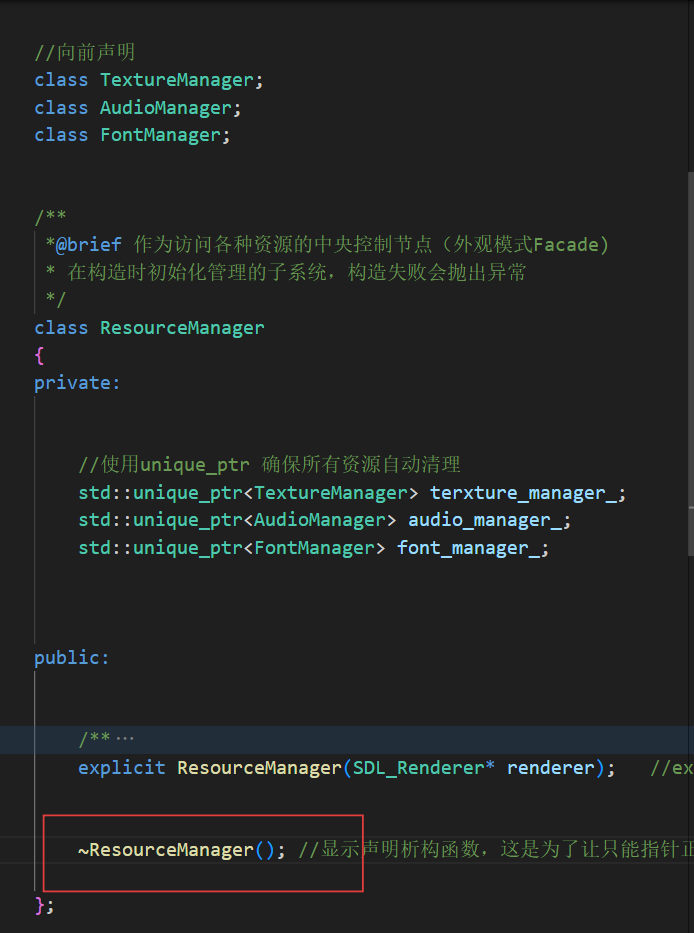

### 1. 不完整类型的问题

在头文件中：

```c++
class TextureManager;  // 向前声明，不完整类型
std::unique_ptr<TextureManager> texture_manager_;  // 包含不完整类型的unique_ptr
```

`TextureManager` 只是一个**向前声明**，编译器此时不知道：

- 它的大小
- 它的析构函数如何调用
- 它的内存布局

### 2. std::unique_ptr 的析构要求

`std::unique_ptr` 的默认删除器（`std::default_delete`）在析构时需要**完整的类型信息**来调用正确的 `delete` 操作。

当编译器在头文件中看到类定义时：

- 如果使用隐式生成的析构函数
- 编译器会尝试为每个成员生成析构代码
- 对于 `std::unique_ptr<TextureManager>`，需要知道 `TextureManager` 的完整定义
- 但此时只有向前声明，导致**编译错误**

### 3. 显式声明的必要性

通过显式声明析构函数：

```c++
~ResourceManager();  // 在头文件中声明
```

然后在实现文件（.cpp）中定义：

```c++
#include "TextureManager.h"  // 包含完整定义
#include "AudioManager.h"
#include "FontManager.h"

ResourceManager::~ResourceManager() = default;  // 或实现具体逻辑
```


### 4. 编译器的工作流程

#### 错误做法（隐式析构）：

```c++
class ResourceManager {
    std::unique_ptr<TextureManager> manager_;  // TextureManager不完整
    // 编译器尝试生成隐式析构函数 ❌
    // 需要TextureManager的完整定义，但找不到！
};
```


#### 正确做法（显式析构）：

```c++
// resource_manager.h
class ResourceManager {
    std::unique_ptr<TextureManager> manager_;
public:
    ~ResourceManager();  // 只是声明，不生成代码
};

// resource_manager.cpp
#include "texture_manager.h"  // 现在TextureManager完整了
ResourceManager::~ResourceManager() {
    // 这里可以安全地析构unique_ptr
    // 因为TextureManager已经是完整类型
}
```


### 5. 同样适用于其他特殊成员函数

这个原则也适用于：

- **拷贝构造函数**：需要显式声明并在实现文件中定义
- **拷贝赋值运算符**：需要显式声明并在实现文件中定义
- **移动构造函数和移动赋值运算符**：如果需要自定义，也需要类似处理

### 6. 为什么 unique_ptr 允许不完整类型？

`std::unique_ptr` 的设计允许使用**不完整类型**进行声明，但**必须在析构时看到完整类型**。这是它的一个特性：

- 可以在头文件中声明不完整类型的 unique_ptr
- 但必须在某个翻译单元中看到完整类型才能析构

### 总结

在这个代码中，`~ResourceManager()` 必须显式声明，因为：

1. 类包含不完整类型的 `std::unique_ptr` 成员
2. 编译器无法为这些成员生成正确的析构代码
3. 需要在实现文件中包含完整类型定义后再定义析构函数
4. 这避免了编译错误，同时保持了接口的简洁性

这是一个 C++ 中处理智能指针和 PIMPL（Pointer to IMPLementation）模式时的常见模式。


## 编译器的工作原理

### 1. **编译单元（Translation Unit）的概念**

- 每个 `.cpp` 文件是一个独立的编译单元
- 编译器**分别编译**每个 `.cpp` 文件，生成对应的 `.o` 目标文件
- 链接器最后将这些 `.o` 文件链接成可执行文件

### 2. **编译器只在自己的编译单元内搜索**

```c++
// resource_manager.h
class ResourceManager {
    std::unique_ptr<TextureManager> manager_;
public:
    ~ResourceManager();  // 声明
};

// === 编译单元 A ===
// main.cpp
#include "resource_manager.h"
int main() {
    ResourceManager rm;  // ✅ 编译通过，只知道声明
    // 不需要知道ResourceManager的析构实现
}

// === 编译单元 B ===
// resource_manager.cpp
#include "resource_manager.h"
#include "texture_manager.h"  // TextureManager的完整定义在这里！

ResourceManager::~ResourceManager() {
    // 编译器在这里才需要知道TextureManager的完整定义
    // 因为这里要生成析构代码
}
```


### 3. **分离编译的关键点**

```
头文件（.h）只包含声明：
- 告诉编译器："有这个东西，但细节在其他地方"

实现文件（.cpp）包含定义：
- 告诉编译器："这是具体的实现细节"

编译器的工作流程：
1. 编译main.cpp时：
   - 看到ResourceManager的声明
   - 看到~ResourceManager()的声明
   - 不生成析构代码（因为没有定义）
   - 只是记录"这个函数在其他地方定义"

2. 编译resource_manager.cpp时：
   - 包含了texture_manager.h
   - TextureManager现在是完整类型
   - 编译器可以生成~ResourceManager()的具体代码
   - 包括如何删除std::unique_ptr<TextureManager>
```


### 4. **为什么这不会出错？**

```c++
// 情景分析：

// 编译resource_manager.cpp时：
#include "texture_manager.h"  // 1. 先包含完整定义
#include "resource_manager.h"  // 2. 再包含类声明

ResourceManager::~ResourceManager() {
    // 3. 编译器看到这里时：
    //    - 已经知道TextureManager是什么
    //    - 知道std::unique_ptr<TextureManager>如何析构
    //    - 可以生成正确的delete调用
}

// 链接时：
// 链接器将各个.o文件合并
// main.o中未解析的~ResourceManager()符号
// 在resource_manager.o中找到实现
```


### 5. **编译错误会发生在哪里？**

cpp

```c++
// 错误示例1：在头文件中定义析构函数
// resource_manager.h
class ResourceManager {
    std::unique_ptr<TextureManager> manager_;
public:
    ~ResourceManager() {}  // ❌ 编译错误！
    // 编译器处理这个头文件时，TextureManager不完整
};

// 错误示例2：实现文件中忘记包含完整定义
// resource_manager.cpp
#include "resource_manager.h"
// 忘记包含texture_manager.h！

ResourceManager::~ResourceManager() {
    // ❌ 编译错误！
    // 编译器不知道TextureManager的完整定义
    // 无法生成正确的析构代码
}
```


### 6. **可视化编译过程**

text

```
编译阶段：
main.cpp ──编译──→ main.o
    ↑              (需要~ResourceManager()的调用地址)
    │
包含头文件
    │
resource_manager.cpp ──编译──→ resource_manager.o
    ↑ 包含完整定义        (包含~ResourceManager()的实现代码)
    │
texture_manager.h

链接阶段：
main.o + resource_manager.o ──链接──→ 可执行文件
         ↳ 提供~ResourceManager()的实现
```


### 7. **关键区别：声明 vs 定义**

cpp

```c++
// 声明（Declaration）：
// 告诉编译器"这个函数存在"
~ResourceManager();

// 定义（Definition）：
// 告诉编译器"这个函数的实现是这样"
ResourceManager::~ResourceManager() {
    // 具体实现
}
```


### 8. **模板类的情况对比**

cpp

```c++
// unique_ptr是模板类，但它的析构器需要完整类型
template<typename T>
class unique_ptr {
    T* ptr;
public:
    ~unique_ptr() { delete ptr; }  // 这里需要T的完整类型！
    // 编译器必须知道如何delete一个T
};
```


### 总结

1. **编译器不会"搜索"实现文件**，而是**编译时处理每个.cpp文件**
2. **头文件被包含到.cpp文件中一起编译**
3. 在 `resource_manager.cpp` 中：
   - 包含了 `texture_manager.h`（完整定义）
   - 定义了 `~ResourceManager()`
   - 编译器看到完整类型，可以生成析构代码
4. 在其他文件中：
   - 只包含头文件，看到声明
   - 不生成析构代码，只生成调用
   - 实际地址由链接器解析

这种设计是 C++ 分离接口和实现的核心机制，允许：

- 接口（头文件）简洁，不暴露实现细节
- 实现（.cpp文件）可以自由修改而不影响其他文件
- 减少编译依赖，提高编译速度


## 自定义智能指针的删除方式

当智能指针的类型没有智能删除方法时（比如SDL_Texture)，如果要智能指针可以自动删除，就需要手动定义一个删除器，和该类型一起传入智能指针的参数。


## 哈希

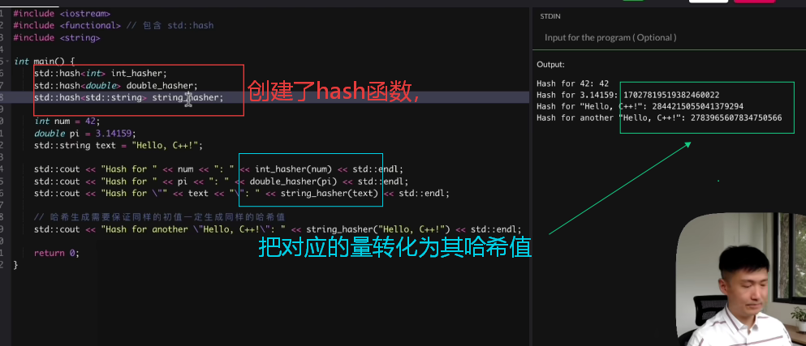

```c++
	//定义字体键路径和大小
    using FontKey = std::pair<std::string, int>;

    //FontKey 的自定义哈希函数,这样之后就可以调用FontKeyHash(FontKey& key)了
    struct FontKeyHash
    {
        std::size_t operator()(const FontKey& key) const
        {
            std::hash<std::string> string_hasher;
            std::hash<int> int_hasher;
            return string_hasher(key.first) ^ int_hasher(key.second);       //最常见的合并hash值的方法，按位异或
        }
    };

    /**
     * @brief 管理 SDL_ttf 字体资源（TTF_Font）。
     *
     * 提供字体的加载和缓存功能，通过文件路径和点大小来标识。
     * 构造失败会抛出异常。仅供 ResourceManager 内部使用。
     */
    class FontManager
    {
        friend class ResourceManager;

    private:
        //TTF_Font的自定义删除器
        struct SDLFontDeleter
        {
            void operator()(TTF_Font* font) const 
            {
                if (font)
                {
                    TTF_CloseFont(font);
                }
            }
        };


        //字体存储器
        //unorder_map的键需要可以转化为哈希值，并且如果时基础数据类型，系统会自动转化
        //如果是自定义类型，系统无法自动转化，则需要传入第三个模板参数，该参数要记载将键转化为哈希值的逻辑
        std::unordered_map<FontKey, std::unique_ptr<TTF_Font, SDLFontDeleter>, FontKeyHash> fonts_;

```


# 06渲染器相机与精灵

## std::optional

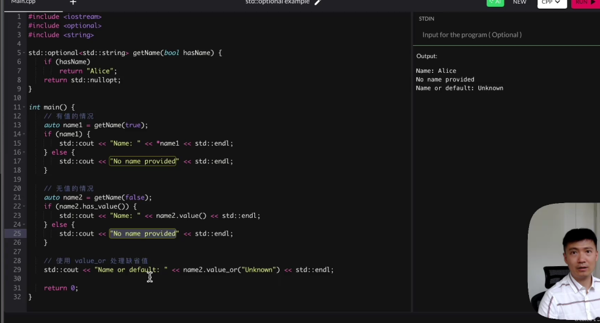


## 视差滚动效果原理

### 🧠 核心原理：抽象出“相机”

在没有引擎时，你首先要建立一个核心概念：**“相机”**。屏幕只是一个窗口，你看到的所有物体都存在于一个更大的“世界坐标系”中。相机的任务，就是决定将世界的哪一部分映射到屏幕这个窗口上。

滚动（或卷轴）的本质，就是**相机在世界坐标系中的移动**。

### 📝 实现步骤与方法

我们将通过以下步骤，从零构建一个基础的滚动系统：

#### 第1步：建立坐标系与相机模型

首先定义你的数据结构：

- **世界坐标 (World Position)**：游戏中所有物体（精灵、背景块）的绝对位置。
- **相机 (Camera)**：一个至少包含 `x` 和 `y` 坐标（表示其世界位置）的对象。它可能还包含 `width` 和 `height`（表示视口大小）。

**关键公式**：一个物体要出现在屏幕上，其屏幕坐标计算公式为：
`屏幕坐标 = 物体世界坐标 - 相机坐标`

例如，相机位于 `(100, 50)`，一个树的世界坐标是 `(150, 80)`，那么它在屏幕上的绘制位置就是 `(50, 30)`。当相机向右移动，物体的屏幕坐标就会减小，产生向左滚动的视觉效果。

#### 第2步：构建游戏循环与绘制管线

在游戏的主循环中，你必须遵循以下顺序：

1. **处理输入**：根据键盘、鼠标输入，更新相机的 `x` 或 `y` 坐标。
2. **更新逻辑**：基于相机新位置，计算所有需要渲染物体的屏幕坐标。
3. **绘制**：**按照从远到近的顺序**，将每个物体绘制在其计算出的屏幕坐标上，后绘制的物体会覆盖先绘制的，从而正确模拟深度。

#### 第3步：实现视差滚动层

在基础相机模型上，通过为不同图层引入不同的**移动速度因子**来实现视差。

**实现方法**：

1. 将背景元素按视觉远近分层（如星空层、远山层、近树层）。
2. 为每一层定义一个 `parallax_factor`（视差因子），通常 `0.0` 到 `1.0` 之间。`0` 表示完全静止（无限远），`1` 表示与相机完全同速（和玩家同层），`0.5` 表示相机移动100像素，该层只移动50像素。
3. **修改屏幕坐标计算公式**：
   `某层物体的屏幕坐标 = 物体世界坐标 - (相机坐标 * 该层的视差因子)`
   注意：这里的“物体世界坐标”对于背景图而言，通常就是其本身的放置位置。

**一个简单的三层背景伪代码示例**：

javascript

```c++
// 假设相机位置 camera_x = 200
let layers = [
  {img: sky_img,   x: 0, factor: 0.0}, // 远景，因子为0，静止
  {img: hills_img, x: 0, factor: 0.3}, // 中景，移动缓慢
  {img: trees_img, x: 0, factor: 0.6}  // 近景，移动较快
];

function draw() {
  for (let layer of layers) {
    // 计算该层的屏幕位置
    let screen_x = layer.x - (camera_x * layer.factor);
    // 在 screen_x 处绘制 layer.img
    drawImage(layer.img, screen_x, 0);
  }
  // ... 然后绘制与相机同速的游戏角色和物体 (factor = 1.0)
}
```


#### 第4步：关键优化技术

1. **循环/无限背景**：
   对于会移动的背景层，当其一部分完全移出屏幕时，需要“回收”它。常用技巧是绘制**两张相同的背景图首尾相连**。当第一张图完全移出屏幕时，立即将其位置重置到第二张图的末尾，形成无缝循环。
2. **脏矩形渲染**：
   这是无引擎开发中提升性能的关键。不要每帧都重绘整个屏幕。只重绘那些内容发生变化的屏幕区域（“脏矩形”），可以极大减少绘制调用。
3. **纹理/精灵批处理**：
   将多个小图片（精灵）合并到一张大图集（Texture Atlas）中。绘制时，通过指定大图集中的坐标矩形来绘制小图。这能减少GPU绘制状态的切换，显著提升性能。


### 移动速度和图片大小的关系

更准确的说法是：**在相同关卡长度下，移动速度越慢的图层（远景），其图片所需的“逻辑宽度”越小；移动速度越快的图层（近景），其图片所需的“逻辑宽度”越大。（当然这里的快慢是相对于屏幕而言的，如果相对于整个世界坐标，则是远景移动最快）**

下面我为你拆解其原理、计算方法和实现技巧。

#### 🧮 核心原理与计算公式

**核心逻辑**：所有图层需要陪伴相机走完相同的 **“关卡总长度”**。由于它们移动速度不同，要“坚持”同样长的游戏时间，它们各自需要的“素材长度”也不同。

**定义**：

- `关卡长度 (L)`：你的相机从关卡起点到终点需要移动的总像素距离（例如 `3000px`）。
- `视差因子 (P)`：该图层的滚动速度因子（例如远景 `0.2`， 近景 `1.0`）。
- `图层所需逻辑宽度 (W)`：该图层的图片需要多宽（在世界坐标系中），才能保证在相机移动 `L` 距离内不会“穿帮”。

**计算公式**：
`图层所需逻辑宽度 (W) = 关卡长度 (L) * 视差因子 (P)`

#### 📐 举例说明

假设你的关卡长度 `L = 3000px`，你有三层：

1. **远景层**（山，因子 `P=0.2`）：
   `W_far = 3000 * 0.2 = 600px`
   这意味着，你只需要一张 **600px宽** 的山景图片，当相机移动3000px时，它在屏幕上只缓慢移动了600px，刚好够用。
2. **中景层**（树林，因子 `P=0.6`）：
   `W_mid = 3000 * 0.6 = 1800px`
   你需要一张 **1800px宽** 的树林图片。
3. **近景层**（灌木，因子 `P=1.0`）：
   `W_near = 3000 * 1.0 = 3000px`
   你需要一张 **3000px宽** 的灌木图片，才能与相机同速并覆盖整个关卡。

#### 🖼️ 实现方法与技巧

1. **图片实际制作**：
   你不需要真的制作一张3000px宽的巨型图片。通常采用 **“无缝拼接图”**。只要图片左右边缘能完美衔接，你就可以在代码中让它**重复绘制**，直到铺满计算出的“逻辑宽度”。

   - **例如**：近景层需要3000px，你可以制作一张600px宽的无缝灌木图，在代码中水平重复绘制5次。

2. **代码中的关键实现**：
   在每一帧绘制时，你需要用 **取模运算** 来实现循环滚动，并设置一个 **滚动上限**。

   ```c++
   // 伪代码示例：绘制一个可循环的图层
   function drawLayer(layerImage, parallaxFactor) {
       // 1. 计算该图层由于相机移动而产生的“世界偏移量”
       let layerOffset = cameraX * parallaxFactor;
   
       // 2. 关键：如果图层需要循环，对单张图片宽度取模
       let singleImageWidth = 600; // 你的无缝图片实际宽度
       let effectiveOffset = layerOffset % singleImageWidth;
   
       // 3. 绘制至少两张图片以覆盖屏幕（处理模运算后的缝隙）
       // 第一张（可能部分在屏幕外）
       drawImage(layerImage, -effectiveOffset, 0);
       // 第二张（紧接第一张右侧）
       drawImage(layerImage, singleImageWidth - effectiveOffset, 0);
   
       // 4. 判断是否到达尽头：如果 layerOffset >= 所需逻辑宽度 (W)，则停止滚动
       if (layerOffset >= L * parallaxFactor) {
           // 通常让最后一帧图片停留在屏幕上，不再更新位置
           return;
       }
   }
   ```

   

3. **同步尽头的判断**：
   在你的主更新逻辑中，判断关卡结束的条件是 **`cameraX >= 关卡长度L`**。当相机到达尽头，所有图层会根据公式自动停止在正确的位置，因为它们各自的 `layerOffset` 也都达到了 `L * P` 的最大值。

#### 💎 总结与表格对比

| 图层类型                 | 视差因子 (P)    | 相对于相机的速度 | 所需逻辑宽度 (W)      | 直观感受                                     |
| :----------------------- | :-------------- | :--------------- | :-------------------- | :------------------------------------------- |
| **远景层**（天空、远山） | 小 (如 0.0-0.3) | 慢               | **小**                | 移动缓慢，感觉遥远，一小段图片就能用很久。   |
| **中景层**（建筑、树林） | 中 (如 0.4-0.7) | 中等             | **中**                | 移动速度适中，需要较宽的图片内容。           |
| **近景层**（灌木、道路） | 大 (如 0.8-1.0) | 快               | **大**（等于或接近L） | 移动飞快，需要大量、宽广的素材才能覆盖全程。 |

**核心结论**：为了让所有图层在**同一游戏进度**（同一相机位置）下开始和结束，**近景层需要最宽、最丰富的图片内容来覆盖其快速移动造成的巨大视觉变化，而远景层则只需要较窄的图片内容**。这正是你在实践中需要规划和制作资源的关键依据。

如果你的关卡是**无限循环**的，那么逻辑就完全不同了——所有图层都需要无缝循环，没有“尽头”概念。你需要根据你想要的游戏类型来决定采用哪种设计。


# 07读取保存配置文件

## 当需要向前声明的类是别名时

json和nlohman_json两个类的定义如下图

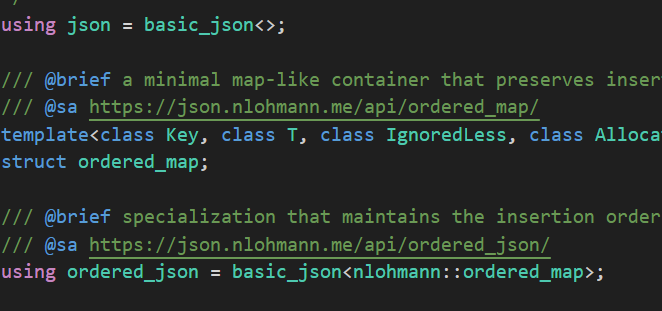

就不可以使用传统class json;和class nolhman_json;的方法向前声明

```c++
#pragma once
#include <string>
#include <vector>
#include <unordered_map>


#include <nlohmann/json_fwd.hpp>        //提供前向声明，相当于class json;和class nolhman_json;
//因为json和nolhman_json两个类是别名而不是真正的名字，所以要引入官方给的头文件来使得可以做到和我们使用前向声明一样的效果


namespace engine::core
{
    


    class Config final
    {

        

    private:
        void fromJson(const nlohmann::json& j);
        nlohmann::ordered_json toJson() const;

    };

}
```


## json的get<T>()函数

## 基本作用

cpp

```c++
// 将 JSON 数据转换为指定类型
auto value = json_obj.get<T>();
```


## 你的例子解析

cpp

```c++
auto input_mappings = mappings_json.get<std::unordered_map<std::string, std::vector<std::string>>>();
```


这行代码的作用：

1. **类型转换**：将 `mappings_json`（nlohmann::json 对象）转换成一个 C++ 的 `unordered_map`
2. **键值类型**：
   - Key：`std::string`
   - Value：`std::vector<std::string>`
3. **自动推导**：使用 `auto` 让编译器自动推导返回类型

## 对应的 JSON 结构

你的代码期望的 JSON 结构应该是这样的：

json

```json
{
  "key1": ["value1", "value2"],
  "key2": ["value3"],
  "key3": ["value4", "value5", "value6"]
}
```


## 其他常用用法

```c++
// 1. 基本类型转换
int num = json_obj.get<int>();
double d = json_obj.get<double>();
std::string str = json_obj.get<std::string>();
bool flag = json_obj.get<bool>();

// 2. 数组转换
std::vector<int> vec = json_obj.get<std::vector<int>>();

// 3. 对象转换
std::map<std::string, int> map = json_obj.get<std::map<std::string, int>>();

// 4. 可选获取（避免异常）
auto value = json_obj.get<std::optional<int>>();
```


## 替代方法对比

cpp

```c++
// 使用 get() - 类型安全的显式转换
auto map = json_obj.get<std::unordered_map<std::string, std::vector<std::string>>>();

// 使用 get_to() - 传入已有变量
std::unordered_map<std::string, std::vector<std::string>> map;
json_obj.get_to(map);

// 使用 运算符= 隐式转换（需要类型匹配）
std::unordered_map<std::string, std::vector<std::string>> map = json_obj;
```


## 错误处理

`get()` 在类型不匹配时会抛出异常：

```c++
try {
    auto map = json_obj.get<std::unordered_map<std::string, std::vector<std::string>>>();
} catch (const nlohmann::json::type_error& e) {
    std::cerr << "类型错误: " << e.what() << std::endl;
}
```


## 总结

`get()` 的主要优势：

- **类型安全**：编译时类型检查
- **直接转换**：一步到位转换为目标类型
- **支持复杂类型**：可以转换嵌套的容器类型
- **异常安全**：类型不匹配时有明确的错误信息


## **std::move() 函数详解**

## **基本定义**

`std::move()` 是 C++11 引入的标准库函数，定义在 `<utility>` 头文件中。它的核心作用是**将左值转换为右值引用**，从而允许编译器调用移动语义（移动构造函数或移动赋值运算符）而非拷贝语义，达到减少不必要的资源拷贝、提升性能的目的。

## **本质与原理**

`std::move()` **并不真正"移动"任何数据**，它只是一个类型转换工具：

```c++
template <typename T>
typename remove_reference<T>::type&& move(T&& t) noexcept {
    return static_cast<typename remove_reference<T>::type&&>(t);
}
```

这个函数本质上是通过 `static_cast` 将传入的参数转换为对应的右值引用类型，使编译器能够将左值视为右值，从而触发移动语义。

## **作用与优势**

1. **避免深拷贝**：在处理大对象（如 `std::string`、`std::vector`）时，移动语义可以避免资源的深拷贝，直接转移资源所有权。
2. **提升性能**：移动操作通常只需要转移指针和重置原对象的状态，而拷贝操作需要分配新内存并复制内容，性能差异显著。
3. **资源高效管理**：对于包含动态内存的对象，移动操作可以避免不必要的内存分配和复制。

## **使用场景**

### **1. 触发移动构造函数**

```c++
std::string src = "Hello, World!";
std::string dest = std::move(src); // 移动构造，src的资源转移到dest
// 此时src可能为空，不再拥有原始数据
```

### **2. 容器操作中避免拷贝**

```c++
std::vector<std::string> vec;
std::string temp = "temporary string";
vec.push_back(std::move(temp)); // 触发移动构造，避免拷贝大字符串
// temp现在处于有效但未指定状态
```

### **3. 函数返回值优化**

```c++
std::string generateMessage() {
    std::string msg = "This is a long message...";
    return std::move(msg); // 显式触发移动，避免拷贝
}
```

> 注意：C++17 起编译器会自动进行 RVO（返回值优化），`std::move` 可能反而阻止优化，需谨慎使用。

### **4. 类成员的移动赋值/构造**

```c++
class MyClass {
    std::string data;
public:
    MyClass(std::string&& str) : data(std::move(str)) { }
    // ...
};
```

## **重要注意事项**

1. **移动后对象状态**：
   - 被 `std::move` 的对象之后不能再被正常使用
   - 原对象处于"合法但未指定状态"（通常为置空状态，如 `std::string` 变为空字符串）
   - 不应再依赖其值，只能被销毁或重新赋值
2. **`std::move` 不等于移动**：
   - `std::move` 只是类型转换，是否执行移动取决于对象类型是否支持移动构造/赋值
   - 例如：`void foo(std::string&& s) { ... }`，即使传入 `std::move(str)`，只有在 `foo` 内部使用移动操作，才会真正移动
3. **基本类型**：
   - 对于基本类型（int、float等），`std::move` 等同于拷贝，因为它们没有移动语义
4. **const 对象**：
   - 不能对 `const` 对象使用 `std::move`，因为 `const` 会阻止资源转移

## **与拷贝的对比**

表格


| 操作        | 描述               | 性能           | 典型使用         |
| :---------- | :----------------- | :------------- | :--------------- |
| 拷贝构造    | `T(const T&)`      | 慢（深拷贝）   | 用于值语义       |
| 移动构造    | `T(T&&)`           | 快（资源转移） | 优化临时对象传递 |
| `std::move` | 类型转换为右值引用 | 快             | 搭配移动构造使用 |

## **总结**

`std::move()` 是 C++11 引入的关键特性，它通过类型转换启用移动语义，使程序能够避免不必要的资源拷贝，提高性能。理解 `std::move` 的本质（类型转换工具而非移动操作）和正确使用场景，对于编写高性能 C++ 代码至关重要。

> **关键点**：`std::move` 的真正含义是"我承诺，在 `std::move` 之后，除了对源对象进行析构或重新赋值外，我不再使用它的当前值。" 这是一个程序员对编译器做出的承诺，违背此承诺会导致未定义行为。


## SDL设置垂直同步的方法

```c++
// 设置 VSync (注意: VSync 开启时，驱动程序会尝试将帧率限制到显示器刷新率，有可能会覆盖我们手动设置的 target_fps)
    int vsync_mode = config_->vsync_enabled_ ? SDL_RENDERER_VSYNC_ADAPTIVE : SDL_RENDERER_VSYNC_DISABLED;
    SDL_SetRenderVSync(sdl_renderer_, vsync_mode);
    spdlog::trace("VSync 设置为: {}", config_->vsync_enabled_ ? "Enabled" : "Disabled");
```


# 08输入管理

## 带初始化的if语句

**常规情况下这样写：it在操作完后依然可见**

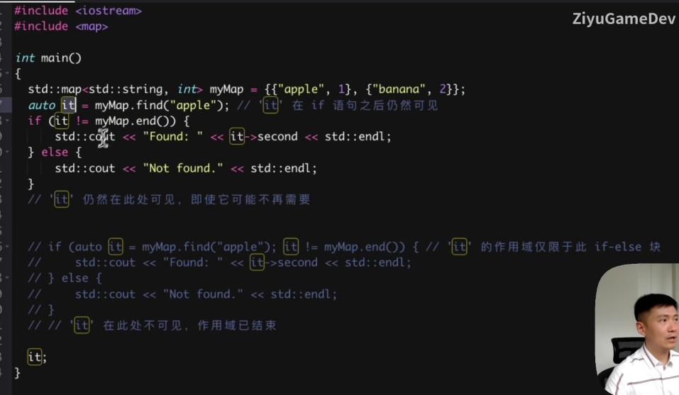

**使用带初始化的if语句：if在使用完之后不可见**

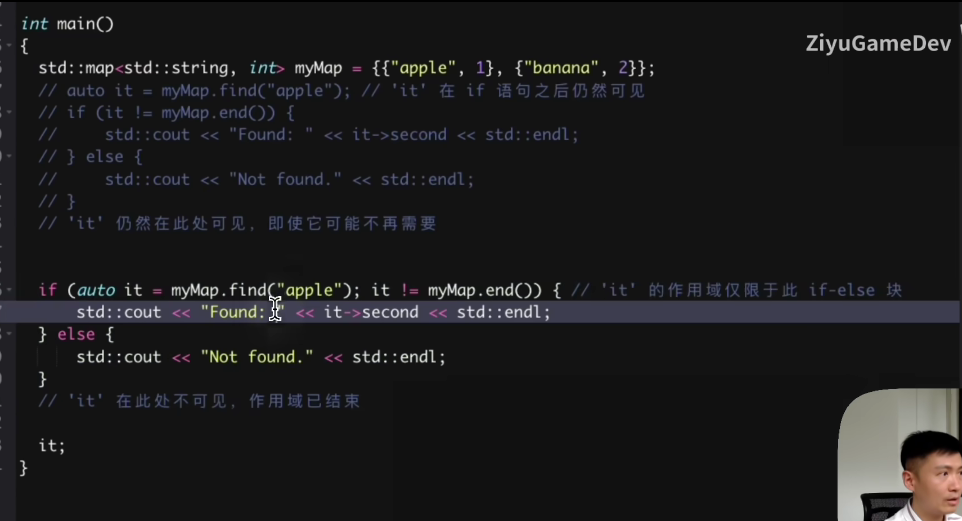


## **\*C++ 容器\** `operator[]` \**初始化与赋值总结\***

#### **\*1.\** `std::unordered_map`**

- **语法**: `unordered_map[key] = value;`

- **功能**: 既可以**插入**新的键值对，也可以**更新**已存在键的值。

- **行为**:

  - 如果 `key` 不存在，会自动创建一个新键值对，其值为类型默认值，并返回该值的引用，然后执行赋值操作。
  - 如果 `key` 已存在，会直接返回其对应值的引用，并执行赋值操作来更新该值。

- **示例**:

  ```c++
  std::unordered_map<std::string, ActionState> action_states;
  std::string action_name = "MyAction";
  action_states[action_name] = ActionState::INACTIVE; // 插入或更新
  ```

- **特点**: 无序存储，基于哈希表，平均查找/插入/删除时间复杂度为 O(1)。

#### ***\*2.\** `std::map`**

- **语法**: `map[key] = value;`

- **功能**: 与 `std::unordered_map` **完全一致**，既可以**插入**新的键值对，也可以**更新**已存在键的值。

- **行为**: 与 `std::unordered_map` 相同。

- **示例**:

  ```c++
  std::map<std::string, ActionState> action_states; // 使用 map
  std::string action_name = "MyAction";
  action_states[action_name] = ActionState::INACTIVE; // 插入或更新，行为同 unordered_map
  ```

- **特点**: 有序存储（按键排序，红黑树），查找/插入/删除时间复杂度为 O(log n)。

#### ***\*3.\** `std::vector`**

- **语法**: `vector[index] = value;`

- **功能**: 用于**访问和赋值**已存在于容器范围内的元素。

- **行为**:

  - `index` **必须**在有效范围内 `[0, size())`。
  - 如果 `index` 有效，会返回对应位置元素的引用，并执行赋值操作。
  - 如果 `index` **无效**（超出范围），行为是**未定义的**，可能导致程序崩溃或数据损坏。

- **示例**:

  ```c++
  std::vector<int> vec(5); // 大小为 5，索引 0-4 有效
  vec[2] = 10; // OK: 对索引 2 处的元素赋值
  
  // vec[10] = 20; // 错误！索引 10 超出范围，未定义行为！
  
  vec.resize(11); // 先扩展大小到 11 (索引 0-10 有效)
  vec[10] = 20;   // 现在 OK
  ```

- **特点**: 连续存储，通过整数索引访问，随机访问时间复杂度为 O(1)。使用 `operator[]` 时**必须**确保索引有效。

#### ***\*总结对比\****

| 容器            | `operator[]`参数 | 不存在时行为           | 存在时行为 | 注意事项                                |
| :-------------- | :--------------- | :--------------------- | :--------- | :-------------------------------------- |
| `unordered_map` | 任意可哈希的键   | **自动插入**，默认值   | 更新值     | 无序                                    |
| `map`           | 任意可比较的键   | **自动插入**，默认值   | 更新值     | 有序                                    |
| `vector`        | 整数索引         | **未定义行为** (危险!) | 更新值     | **必须**确保索引在 `[0, size())` 范围内 |

`action_states[action_name] = value;` 这种模式在关联容器 (`map`, `unordered_map`) 中是安全且常用的操作，但在序列容器 (`vector`) 中需要格外小心索引的有效性。


## std::variant<T1,T2...>

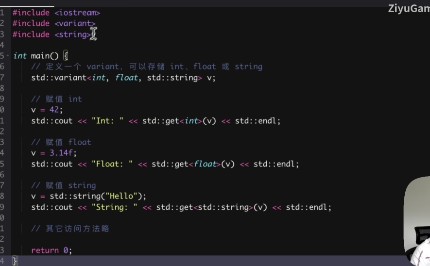

`std::variant` 是 C++17 引入的一个非常有用的模板类，它的核心作用是**在一个对象中安全地存储多种不同类型的值中的某一种**。

你可以把它想象成一个**类型安全的联合体 (union)**，或者一个**可以安全切换类型的容器**。

### **`std::variant` \**的主要用途和优势\****

1. **类型安全的联合体 (Type-Safe Union)**:
   - **传统 `union` 的问题**: C 语言风格的 `union` 可以在同一个内存位置存储不同类型的数据，但**没有类型信息**。你必须自己记住当前存的是哪种类型，如果用错了类型去读取，就会导致未定义行为，非常不安全。
   - **`std::variant` 的解决方案**: `variant` 内部会记录当前存储的是哪个类型，并且提供了安全的访问机制（如 `std::get`, `std::visit`），避免了类型不匹配的风险。
2. **表达“或”类型 (Sum Types / Tagged Unions)**:
   - 它非常适合表示一个值**可能属于几种不同类型中的一种**的情况。例如，一个函数的返回值可能是一个结果对象，也可能是一个错误信息（`std::variant<Result, Error>`）。
   - 这在解析、状态机、网络协议处理等场景中非常常见。
3. **避免使用基类指针/引用来管理多态对象**:
   - 如果你需要在几种**没有继承关系**的类型之间切换，`variant` 提供了一种比使用基类指针 (`Base*`) 或 `std::any` 更高效、更安全的选择。
4. **高效的数据结构**:
   - `variant` 保证只存储其可能类型中最大的那个所需的内存（加上存储类型信息所需的少量开销），避免了动态分配内存，内存效率高。

### ***\*基本用法示例\****

```c++
#include <variant>
#include <string>
#include <iostream>

int main() {
    // 1. 定义一个 variant，它可以存储 int, double, 或 std::string 中的一种
    std::variant<int, double, std::string> var;

    // 2. 赋值 - 可以赋值为不同类型的值
    var = 42;          // 现在存储的是 int
    std::cout << "var holds an int: " << std::get<int>(var) << std::endl;

    var = 3.14;        // 现在存储的是 double
    std::cout << "var holds a double: " << std::get<double>(var) << std::endl;

    var = "Hello";     // 现在存储的是 std::string
    std::cout << "var holds a string: " << std::get<std::string>(var) << std::endl;

    // 3. 检查当前存储的类型
    std::cout << "Index: " << var.index() << std::endl; // 输出当前类型的索引 (string 是 2)

    // 4. 安全地访问 (避免 std::get 抛出异常)
    // 使用 std::holds_alternative 检查类型
    if (std::holds_alternative<std::string>(var)) {
        std::string str = std::get<std::string>(var);
        std::cout << "It's a string: " << str << std::endl;
    }

    // 5. 使用 std::visit 进行泛型访问 (非常强大)
    std::visit([](const auto& value) {
        std::cout << "Visited value: " << value << std::endl;
    }, var); // 会自动调用 lambda，传入当前存储的值

    return 0;
}
```

### ***\*常用操作\****

- **构造**: `std::variant<T1, T2, ...> v(value);`
- **赋值**: `v = value_of_type_T1_or_T2_or_...;`
- **获取值**: `std::get<T>(v)` 或 `std::get<index>(v)`。如果类型不匹配会抛出 `std::bad_variant_access` 异常。
- **检查类型**: `std::holds_alternative<T>(v)` 返回 `true` 如果 `v` 当前存储的是 `T`。
- **获取索引**: `v.index()` 返回当前存储类型的索引（从 0 开始）。
- **访问**: `std::visit(visitor, v, ...)` 允许你定义一个访问者（如 lambda 或函数对象），它会根据 `variant` 当前存储的类型自动调用访问者对应的重载。

### ***\*总结\****

`std::variant` 的主要作用是提供一种**类型安全、内存高效**的方式来处理一个值可能是多种不同类型之一的场景。它解决了传统 `union` 的类型安全问题，并为 C++ 提供了强大的“或”类型支持，是现代 C++ 中处理复杂数据结构和状态的有力工具。


## SDL_PollEvent(SDL_Event*)

### 源码

```c++
/**
 * 轮询当前正在等待的事件。
 *
 * 如果 `event` 不为 NULL，将从队列中移除下一个事件，并将其存储到 `event` 指向的 SDL_Event 结构体中。
 * 返回的 1 指代的就是这个立即存储在 SDL Event 结构体中的事件，而不是指后续将要发生的事件。
 *
 * 如果 `event` 为 NULL，它仅仅会返回 1（如果队列中有事件的话），但不会将事件从队列中移除。
 *
 * 由于此函数可能会隐式地调用 SDL_PumpEvents()，你只能在设置视频模式的线程中调用此函数。
 *
 * SDL_PollEvent() 是接收系统事件的首选方式，因为它可以在主循环中执行，
 * 并且在等待事件发布时不会挂起主循环。
 *
 * 常见的做法是在每一帧（frame）中处理一次事件队列，通常作为更新游戏状态之前的第一个步骤：
 *
 * ```c
 * while (游戏仍在运行) {
 *     SDL_Event event;
 *     while (SDL_PollEvent(&event)) {  // 轮询直到所有事件都被处理！
 *         // 决定如何处理这个事件。
 *     }
 *
 *     // 更新游戏状态，绘制当前帧
 * }
 * ```
 *
 * \param event 指向 SDL_Event 结构体的指针，用于接收队列中的下一个事件；如果为 NULL 则不接收。
 * \returns 如果获取到了一个事件则返回 true，如果没有可用事件则返回 false。
 *
 * \线程安全性 此函数只能在主线程上调用。
 *
 * \since 此函数自 SDL 3.2.0 版本起可用。
 *
 * \sa SDL_PushEvent
 * \sa SDL_WaitEvent
 * \sa SDL_WaitEventTimeout
 */
extern SDL_DECLSPEC bool SDLCALL SDL_PollEvent(SDL_Event *event);
```

### 使用实例

```c++
SDL_Event event;
        while (SDL_PollEvent(&event))   // 轮询直到所有事件都被处理！
        {
            processEvent(event);
        }
```


# 09游戏对象与组件

## 一些新东西

```c++
// 检测组件是否合法。 
/*  static_assert(condition, message)：静态断言，如果condition为true则什么也不做，为false则输出message，在编译期检测，无任何性能影响 */
/* std::is_base_of<Base, Derived>::value -- 判断 Base 类型是否是 Derived 类型的基类 */
static_assert(std::is_base_of<engine::component::Component, T>::value, "T 必须继承自 Component");
// 获取类型标识。     
/* typeid(T) -- 用于获取一个表达式或类型的运行时类型信息 (RTTI), 返回 std::type_info&（类型信息） */
/* std::type_index -- 针对std::type_info对象的包装器（也就是把std::type_info包装为一个std::type_index），主要设计用来作为关联容器（如 std::map）的键。*/
auto type_index = std::type_index(typeid(T));
```


## 模板可变参数

当我们的模板参数数量不确定时可以使用这种方法，**格式如下：**

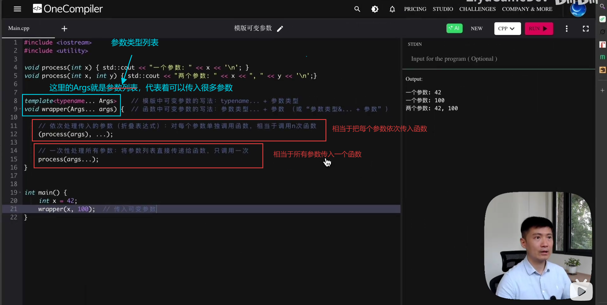

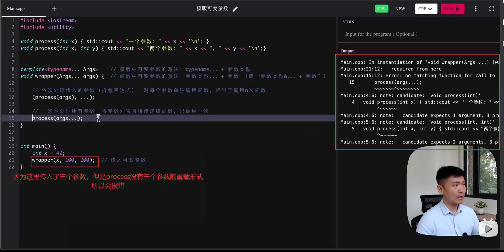

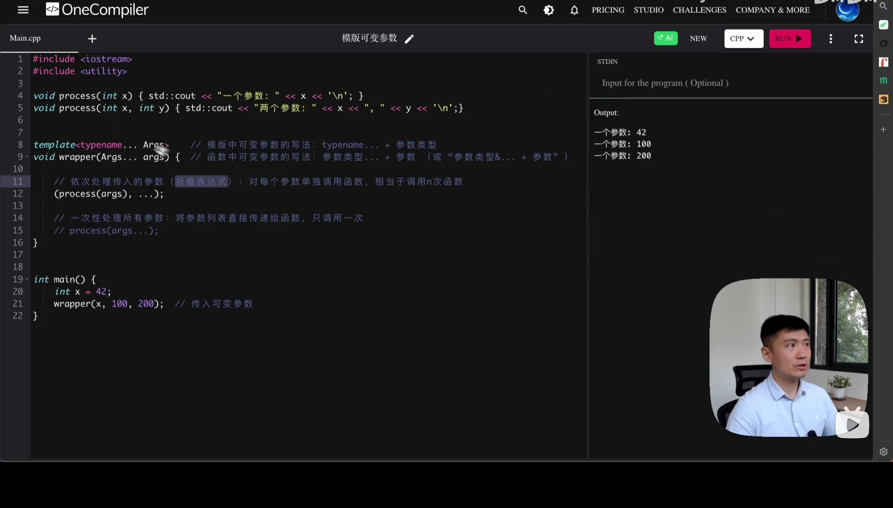

**如果传入的是引用就要放在这个位置，并且由于要传入引用，所以wrapper（）的参数就不可以是100，因为传入的参数应该是“左值”**

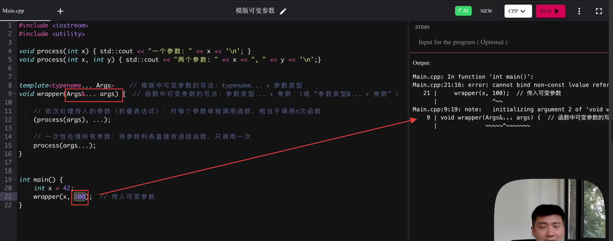


### std::forward<T>();  完美转发

这是模板可变参数的进阶写法，可以避免传入参数的时候进行拷贝，而是传入引用。

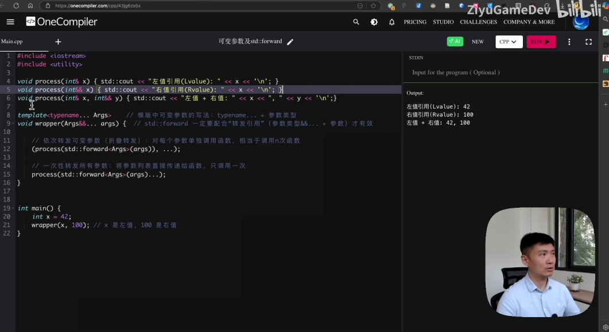


## **C++ 完美转发详解**

### **1. 核心概念与问题背景**

#### **什么是完美转发 (Perfect Forwarding)？**

完美转发是指在函数模板中，将参数从一个函数传递给另一个函数时，**完全保持原参数的所有性质不变**：

- **值类别 (Value Category)**: 左值 (lvalue) / 右值 (rvalue)
- **cv限定符 (cv-qualifiers)**: const / volatile
- **引用类型**: 是否为引用

#### **为什么需要完美转发？**

让我们先看一个不使用完美转发的问题示例：

```c++
#include <iostream>
#include <utility>

// 目标函数：重载版本
void target(int& x) { std::cout << "Called with lvalue\n"; }
void target(int&& x) { std::cout << "Called with rvalue\n"; }

// 传统转发方式（有问题）
template<typename T>
void bad_forward(T arg) {
    target(arg);  // 问题：arg 在这里总是左值！
}

int main() {
    int x = 42;
    
    // 期望：调用 target(int&) -> "Called with lvalue"
    bad_forward(x);        // 实际：调用 target(int&) -> "Called with lvalue" ✓
    
    // 期望：调用 target(int&&) -> "Called with rvalue" 
    bad_forward(42);       // 实际：调用 target(int&) -> "Called with lvalue" ❌
                           // 因为 arg 是函数内的局部变量，是左值
    return 0;
}
```

**问题根源**：在 `bad_forward` 函数内部，无论传入的是左值还是右值，参数 `arg` 都是一个具名的变量，因此它永远是左值！

### **2. 实现原理详解**

#### **2.1 模板参数推导规则 (Template Argument Deduction Rules)**

这是完美转发的第一个关键原理：

```c++
template<typename T>
void forward_function(T&& param);  // 这里的 T&& 不是右值引用！

// 当调用 forward_function(expr) 时：
// - 如果 expr 是左值 int，那么 T 被推导为 int&，param 类型变为 int& && → int& (引用折叠)
// - 如果 expr 是右值 int，那么 T 被推导为 int，param 类型变为 int&&
```

**引用折叠 (Reference Collapsing) 规则**：

- `& &` → `&`
- `& &&` → `&`
- `&& &` → `&`
- `&& &&` → `&&`

#### **2.2 std::forward 的实现原理**

`std::forward` 的简化实现如下：

```c++
template<typename T>
T&& forward(typename std::remove_reference<T>::type& t) noexcept {
    return static_cast<T&&>(t);
}

// 或者更常见的形式：
template<typename T>
constexpr T&& forward(std::remove_reference_t<T>& t) noexcept {
    return static_cast<T&&>(t);
}
```

**std::forward 的工作方式**：

```c++
template<typename T>
void perfect_forward(T&& param) {
    // 如果 T 是 int& (来自左值)，则 std::forward<int&>(param) 返回 int&
    // 如果 T 是 int (来自右值)，则 std::forward<int>(param) 返回 int&&
    target(std::forward<T>(param));
}
```

#### **2.3 完整的工作流程**

```c++
#include <iostream>
#include <utility>

void target(int& x) { std::cout << "target(int&)\n"; }
void target(int&& x) { std::cout << "target(int&&)\n"; }

template<typename T>
void perfect_forward(T&& param) {
    std::cout << "In perfect_forward: ";
    target(std::forward<T>(param));
}

int main() {
    int x = 42;
    
    std::cout << "Calling with lvalue:\n";
    perfect_forward(x);      // T=int&, param=int&, forward返回int&
    
    std::cout << "Calling with rvalue:\n";
    perfect_forward(42);     // T=int, param=int&&, forward返回int&&
    
    return 0;
}
```

### **3. 完美转发的高级应用**

#### **3.1 变参模板与完美转发**

```c++
#include <iostream>
#include <utility>
#include <memory>

class MyClass {
public:
    MyClass(int x, double y, const std::string& z) {
        std::cout << "MyClass constructed with: " << x << ", " << y << ", " << z << "\n";
    }
};

template<typename T, typename... Args>
std::unique_ptr<T> make_unique_perfect(Args&&... args) {
    // 完美转发所有参数到T的构造函数
    return std::make_unique<T>(std::forward<Args>(args)...);
}

int main() {
    auto ptr = make_unique_perfect<MyClass>(
        42,           // rvalue int
        3.14,         // rvalue double  
        std::string{"hello"}  // rvalue string
    );
    return 0;
}
```

#### **3.2 完美转发与移动语义**

```c++
#include <iostream>
#include <utility>
#include <vector>
#include <string>

class HeavyObject {
private:
    std::vector<int> data_;
public:
    explicit HeavyObject(size_t size) : data_(size, 42) {
        std::cout << "HeavyObject constructed with " << size << " elements\n";
    }
    
    // 移动构造函数
    HeavyObject(HeavyObject&& other) noexcept 
        : data_(std::move(other.data_)) {
        std::cout << "HeavyObject moved\n";
    }
    
    // 拷贝构造函数
    HeavyObject(const HeavyObject& other) 
        : data_(other.data_) {
        std::cout << "HeavyObject copied\n";
    }
};

template<typename T>
void process_object(T&& obj) {
    std::cout << "Processing object...\n";
    HeavyObject local_obj(std::forward<T>(obj));  // 关键：完美转发
}

int main() {
    HeavyObject original(1000);
    
    std::cout << "Passing as lvalue (should copy):\n";
    process_object(original);  // T=HeavyObject&, forward返回HeavyObject& → 调用拷贝构造
    
    std::cout << "\nPassing as rvalue (should move):\n";
    process_object(std::move(original));  // T=HeavyObject, forward返回HeavyObject&& → 调用移动构造
    
    return 0;
}
```

### **4. 实现细节与陷阱**

#### **4.1 std::forward 的完整实现**

```c++
namespace my_std {
    // forward for lvalue references
    template<class T>
    constexpr T&& forward(remove_reference_t<T>& t) noexcept {
        return static_cast<T&&>(t);
    }

    // forward for rvalue references  
    template<class T>
    constexpr T&& forward(remove_reference_t<T>&& t) noexcept {
        static_assert(!is_lvalue_reference_v<T>, "can't forward an rvalue as an lvalue");
        return static_cast<T&&>(t);
    }
}
```

#### **4.2 常见陷阱**

```c++
// 错误1：忘记使用 std::forward
template<typename T>
void bad_wrapper(T&& t) {
    some_function(t);  // 错误：t 总是左值
    // 应该是：some_function(std::forward<T>(t));
}

// 错误2：对非模板参数使用 std::forward
void bad_usage(int x) {
    int y = std::forward<int>(x);  // 无意义，x 本来就是左值
}

// 正确：只在模板中对万能引用使用 std::forward
template<typename T>
void correct_usage(T&& param) {
    some_function(std::forward<T>(param));  // 正确
}
```

### **5. 性能优势**

完美转发的主要性能优势在于**避免不必要的拷贝**：

```c++
#include <chrono>
#include <vector>
#include <string>

class ExpensiveObject {
    std::vector<int> data;
public:
    ExpensiveObject(size_t n) : data(n, 42) {}
    
    // 拷贝很昂贵
    ExpensiveObject(const ExpensiveObject& other) : data(other.data) {
        std::this_thread::sleep_for(std::chrono::milliseconds(100)); // 模拟昂贵拷贝
    }
    
    // 移动很便宜
    ExpensiveObject(ExpensiveObject&& other) noexcept : data(std::move(other.data)) {}
};

template<typename T>
auto factory(T&& arg) {
    return std::make_unique<ExpensiveObject>(std::forward<T>(arg));  // 避免拷贝！
}
```

通过完美转发，我们可以确保在适当的时候使用移动语义，从而获得最佳性能。


## **C++ 左值引用与右值引用详解**

### **1. 左值引用 (Lvalue Reference) vs 右值引用 (Rvalue Reference)**

#### **1.1 基本定义**

**左值引用 (`&`)**：

- 绑定到左值（有身份、可寻址的对象）
- 通常用于延长临时对象的生命周期或作为函数参数避免拷贝

**右值引用 (`&&`)**：

- 绑定到右值（临时对象、即将销毁的对象）
- 主要用于实现移动语义和完美转发

```c++
#include <iostream>
#include <string>

int main() {
    // 左值：有名字，可以取地址
    int x = 42;           // x 是左值
    int& lref = x;        // 左值引用绑定到左值 ✓
    
    // 右值：临时对象，没有持久身份
    int&& rref = 42;      // 右值引用绑定到右值 ✓
    int&& rref2 = x + 1;  // 右值引用绑定到临时表达式 ✓
    
    // int& lref2 = 42;   // 错误：左值引用不能绑定到右值
    
    std::cout << "lref = " << lref << ", rref = " << rref << std::endl;
    return 0;
}
```

### **2. 为什么** `&&` **表示右值引用，**`&` **表示左值引用？**

#### **2.1 语法设计的逻辑**

这个设计是**人为规定的**，但有其内在逻辑：

1. **历史延续性**：`&` 一直是左值引用的符号
2. **对称性**：既然左值引用用一个 `&`，那么右值引用就用两个 `&`
3. **直观性**：`&&` 看起来比单个 `&` "更强"，表示可以"抓取"临时对象

#### **2.2 关键区别：绑定规则**

cpp


```c++
#include <iostream>

void func_lvalue(int& x) { std::cout << "Lvalue reference\n"; }
void func_rvalue(int&& x) { std::cout << "Rvalue reference\n"; }

int main() {
    int a = 10;
    
    // 左值引用只能绑定左值
    int& lr = a;          // ✓
    // int& lr2 = 20;     // ✗ 编译错误
    
    // 右值引用只能绑定右值
    int&& rr = 20;        // ✓
    int&& rr2 = a + 5;    // ✓
    // int&& rr3 = a;     // ✗ 编译错误
    
    func_lvalue(a);       // ✓ 调用左值引用版本
    func_rvalue(30);      // ✓ 调用右值引用版本
    
    return 0;
}
```

### **3. 深入理解值类别 (Value Categories)**

#### **3.1 C++11 的值类别模型**

```
表达式
├── 左值 (lvalue): 有身份 (identity)，不可移动
├── 将亡值 (xvalue): 有身份 (identity)，可移动  
└── 纯右值 (prvalue): 无身份 (no identity)，可移动
    └── 合并为右值 (rvalue)
```

#### **3.2 绑定规则详解**

```c++
#include <iostream>
#include <string>

int main() {
    int x = 42;           // x 是左值
    int& lref = x;        // 左值引用 ← 左值 ✓
    
    int&& rref1 = 42;     // 右值引用 ← 纯右值 ✓
    int&& rref2 = x + 1;  // 右值引用 ← 纯右值 ✓
    
    // 特殊情况：右值引用变量本身是左值！
    int&& temp = x + 5;   // temp 是右值引用变量
    int& lr2 = temp;      // temp 在这里作为左值 ✓
    // int&& rr2 = temp;  // 错误！temp 是左值
    
    std::cout << "temp = " << temp << std::endl;
    
    return 0;
}
```

### **4. 实际应用示例**

#### **4.1 移动语义中的应用**

```c++
#include <iostream>
#include <vector>

class MyVector {
private:
    std::vector<int> data_;
    
public:
    // 构造函数
    MyVector(size_t size) : data_(size, 42) {
        std::cout << "Constructed with size " << size << std::endl;
    }
    
    // 拷贝构造函数：深拷贝
    MyVector(const MyVector& other) : data_(other.data_) {
        std::cout << "Copy constructor called\n";
    }
    
    // 移动构造函数：转移资源
    MyVector(MyVector&& other) noexcept : data_(std::move(other.data_)) {
        std::cout << "Move constructor called\n";
    }
    
    // 拷贝赋值
    MyVector& operator=(const MyVector& other) {
        if (this != &other) {
            data_ = other.data_;
        }
        std::cout << "Copy assignment called\n";
        return *this;
    }
    
    // 移动赋值
    MyVector& operator=(MyVector&& other) noexcept {
        if (this != &other) {
            data_ = std::move(other.data_);
        }
        std::cout << "Move assignment called\n";
        return *this;
    }
};

int main() {
    MyVector v1(1000);           // 构造
    MyVector v2(v1);             // 拷贝构造：左值 → const MyVector&
    MyVector v3(std::move(v1));  // 移动构造：右值 → MyVector&&
    
    return 0;
}
```

#### **4.2 函数重载中的应用**

```c++
#include <iostream>
#include <string>

class StringProcessor {
public:
    // 接受左值：可能需要保留原对象
    void process(const std::string& str) {
        std::cout << "Processing lvalue: " << str << " (copy may occur)\n";
    }
    
    // 接受右值：可以"偷取"资源
    void process(std::string&& str) {
        std::cout << "Processing rvalue: " << str << " (can move)\n";
        // str 在这里可以被修改，因为它是将亡值
    }
};

int main() {
    StringProcessor processor;
    std::string s = "Hello";
    
    processor.process(s);              // 调用 const std::string& 版本
    processor.process(std::move(s));   // 调用 std::string&& 版本
    processor.process("World");        // 调用 std::string&& 版本
    
    return 0;
}
```

### **5. 万能引用 (Universal Reference) 的特殊情况**

**重要**：当 `&&` 出现在模板参数推导上下文中时，它不再是右值引用！

```c++
#include <iostream>

template<typename T>
void universal_ref(T&& param) {  // 这是万能引用！
    // 如果传入左值，T 推导为 T&，param 变为 T& (左值引用)
    // 如果传入右值，T 推导为 T，param 变为 T&& (右值引用)
    std::cout << "Function called\n";
}

int main() {
    int x = 42;
    
    universal_ref(x);      // T=int&, param=int&, 绑定到左值
    universal_ref(42);     // T=int, param=int&&, 绑定到右值
    
    return 0;
}
```

### **6. 总结**

| 特性     | 左值引用 (`&`) | 右值引用 (`&&`)      |
| :------- | :------------- | :------------------- |
| 语法符号 | `&`            | `&&`                 |
| 绑定对象 | 左值           | 右值                 |
| 生命周期 | 延长临时对象   | 资源转移             |
| 主要用途 | 避免拷贝       | 移动语义、完美转发   |
| 变量本身 | 作为左值       | 作为左值（当具名时） |

**设计哲学**：`&` 和 `&&` 的区别不仅仅是为了语法区分，更重要的是体现了C++对**资源管理**和**性能优化**的考虑。右值引用使得移动语义成为可能，大大提高了C++程序的性能。


## 模板类必须在头文件中声明和定义

C++模板函数（包括类模板的成员函数）**不能**在头文件中声明，而在cpp文件中实现。这是C++模板机制的一个重要特性。

根据知识库中的信息：

1. 从[2]中明确指出："模板的实现通常要求放在头文件中，这与普通类和函数的实现方式不同。普通类和函数可以将声明放在头文件（.h）中，实现放在源文件（.cpp）中...但模板的特性使得这种分离编译方式变得复杂。"
2. 从[6]中："C++支持两种模板编译模式：包含模式和分离模式。...但是并不是所有的编译器都支持分离模式，即使支持也未必总能支持得很好...现在的VC++编译器都不知道模板分离编译模式，所以我们还是好好的把定义与实现都放在一个文件中吧。"
3. 从[8]中："模板函数实现写在头文件里面，没任何问题，外部可以引用。如果模板函数只被类自己引用，那么可以写在cpp中，如果函数要被外部引用，那么就不能写在cpp中。"
4. 从[11]中："在实际开发中，我们通常会将类的声明和定义分别放在头文件(.h)和源文件(.cpp)中。但对于模板类，这种做法会导致链接错误。"

**为什么不能这样做？**

C++模板在编译时需要根据具体类型实例化。当编译器编译使用模板的文件时，它需要看到模板的完整定义才能为特定类型生成代码。如果模板实现放在cpp文件中，当编译其他文件使用该模板时，编译器无法看到实现，因此无法生成正确的实例化代码。

**正确的做法：**

1. 将模板函数的声明和实现都放在头文件中：

```c++
// MyTemplate.h
template <typename T>
class MyClass {
public:
    void myFunction(T param); // 声明
};

// 实现直接在头文件中
template <typename T>
void MyClass<T>::myFunction(T param) {
    // 实现代码
}
```

1. 或者，将整个模板类的定义放在头文件中：

```c++
// MyTemplate.h
template <typename T>
class MyClass {
public:
    void myFunction(T param) {
        // 实现代码
    }
};
```

**例外情况：**

如[8]所述，如果模板函数**只被类自身使用**（即私有成员函数，没有被外部代码调用），那么可以将其实现放在cpp文件中。但这种情况很少见，且不推荐，因为这样会增加代码的复杂性。

**总结：**

C++模板函数（包括类模板的成员函数）**必须**在头文件中实现，不能放在cpp文件中。这是C++模板机制的固有特性，不是C++语言的缺陷，而是为了支持泛型编程而设计的。将模板实现放在头文件中是C++模板编程的**最佳实践**。


### **C++模板实例化机制的详细解释**

你提到的这段话非常准确，我来详细解释C++模板实例化机制为什么要求模板的实现必须放在头文件中，而不是cpp文件中。

#### **1. 模板的本质**

C++模板不是真正的函数或类，它只是一个"图纸"，编译器需要根据具体类型参数来生成实际的代码。正如知识库[5]中所述：

> "模板并不是真正的函数或类，它仅仅是编译器用来生成函数或类的一张'图纸'。模板不会占用内存，最终生成的函数或者类才会占用内存。由模板生成函数或类的过程叫做模板的实例化，相应地，针对某个类型生成的特定版本的函数或类叫做模板的一个实例。"

#### **2. 编译过程与模板实例化的时机**

C++的编译过程包括预处理、编译、汇编和链接四个阶段。模板实例化发生在**编译阶段**，而不是链接阶段。

- **编译阶段**：源文件(.cpp)被编译成目标文件(.o或.obj)。
- **链接阶段**：多个目标文件被组合成可执行文件或库。

**关键点**：模板实例化必须在编译阶段完成，因为编译器需要在编译使用模板的文件时生成具体的代码。

#### **3. 为什么模板实现不能放在cpp文件中**

让我详细解释为什么模板实现不能放在cpp文件中：

##### **3.1 编译器的编译流程**

当编译器编译`main.cpp`时，它会：

1. 预处理：处理`#include`、宏定义等
2. 编译：将C++代码转换为汇编代码或中间表示
3. 汇编：将汇编代码转换为目标代码
4. 链接：将多个目标文件组合成可执行文件

在编译`main.cpp`时，编译器**只看到**`main.cpp`中包含的头文件，以及`main.cpp`中直接定义的函数/类。

##### **3.2 问题示例**

假设我们有以下代码：

**myclass.h**:

```c++
template <typename T>
class MyClass {
public:
    void myFunction(T value);
};
```

**myclass.cpp**:

```c++
#include "myclass.h"

template <typename T>
void MyClass<T>::myFunction(T value) {
    // 实现
}
```

**main.cpp**:

```c++
#include "myclass.h"

int main() {
    MyClass<int> obj;
    obj.myFunction(10);
    return 0;
}
```

当编译器编译`main.cpp`时：

1. 它看到`#include "myclass.h"`，知道`MyClass`是一个模板类。
2. 遇到`MyClass<int> obj;`，需要实例化`MyClass<int>`。
3. 为了实例化`MyClass<int>`，编译器需要`myFunction`的实现。
4. 但是，`myFunction`的实现在`myclass.cpp`中，而`main.cpp`没有包含`myclass.cpp`。
5. 因此，编译器找不到`myFunction`的实现，导致编译错误。

##### **3.3 为什么链接器不能解决这个问题**

链接器负责解决符号引用，但模板实例化是编译时行为，不是链接时行为。链接器在链接阶段才工作，而模板实例化必须在编译阶段完成。

- 编译器在编译`main.cpp`时，需要为`MyClass<int>::myFunction`生成代码。
- 如果编译器在编译`main.cpp`时看不到实现，它就无法生成代码。
- 即使`myclass.cpp`被编译成目标文件，编译器在处理`main.cpp`时也无法看到`myclass.cpp`中的模板实现，因为编译器只处理当前文件和包含的头文件。

#### **4. 为什么头文件可以解决这个问题**

将模板实现放在头文件中，可以确保当编译器编译使用模板的文件时，它能看到完整的模板定义。

**正确做法**：

**myclass.h**:

```c++
template <typename T>
class MyClass {
public:
    void myFunction(T value);
};

// 在头文件中实现成员函数
template <typename T>
void MyClass<T>::myFunction(T value) {
    // 实现
}
```

这样，当编译器编译`main.cpp`时，它会看到`myFunction`的完整定义，可以正确地为`int`类型生成实例化代码。

#### **5. 显式实例化的例外情况**

C++提供了一种叫做"显式实例化"（Explicit Instantiation）的机制，可以将模板的实例化放在cpp文件中，但需要特别处理：

**myclass.h**:

```c++
template <typename T>
class MyClass {
public:
    void myFunction(T value);
};
```

**myclass.cpp**:

```c++
#include "myclass.h"

// 显式实例化
template class MyClass<int>;
template class MyClass<double>;

// 实现可以放在cpp文件中，但需要在显式实例化之后
template <typename T>
void MyClass<T>::myFunction(T value) {
    // 实现
}
```

**main.cpp**:

```c++
#include "myclass.h"

int main() {
    MyClass<int> obj1;
    obj1.myFunction(10);
    
    MyClass<double> obj2;
    obj2.myFunction(3.14);
    return 0;
}
```

在这种情况下：

1. `myclass.cpp`显式实例化了`MyClass<int>`和`MyClass<double>`。
2. 编译器在编译`myclass.cpp`时，为这些类型生成了实例化代码。
3. 当`main.cpp`使用`MyClass<int>`和`MyClass<double>`时，编译器可以从`myclass.cpp`的目标文件中找到这些实例化代码。

但是，这种方法要求你**预先知道**将要使用的模板类型，并且会限制模板的灵活性。如果你使用了未显式实例化的类型（如`MyClass<float>`），编译器仍然会找不到实现。

#### **6. 为什么标准库使用包含模型**

正如知识库[8]中所述：

> "在包含模型中，在使用模板的每个文件中都加入成员定义。这是最简单的方法，它在可与模板一起使用的具体类型方面提供了最大的灵活性。缺点是会增加编译时间。"

标准库（如STL）采用包含模型，因为：

- 它提供了最大的灵活性，允许用户使用任何类型。
- 它是最简单、最容易维护的方法。
- 对于大多数项目，编译时间的增加是可以接受的。

#### **7. 总结**

C++模板实例化必须在编译时完成，编译器必须在编译使用模板的文件时看到模板的完整定义。如果模板实现放在cpp文件中，编译器在编译使用模板的文件时无法看到实现，因此无法生成正确的实例化代码。

这就是为什么模板实现通常必须放在头文件中的原因。虽然显式实例化提供了一种将模板实现放在cpp文件中的方法，但这需要预先知道将要使用的模板类型，并且会限制模板的灵活性。

记住，模板是编译时机制，不是链接时机制，所以实例化必须在编译阶段完成，而不是在链接阶段。


## **C++编译器对模板函数和普通函数的查找机制详解**

你的问题非常好，我来详细解释C++编译器如何处理模板函数和普通函数的查找机制。

### **为什么编译器不会到cpp文件里找模板函数的实现**

#### **模板实例化是编译时行为**

C++模板的实例化发生在**编译阶段**，而不是链接阶段。这是关键区别。

正如知识库[6]中所述：

> "对于模板来说，实现不是实例化，模板的具体实例化一般并不会在代码中书写，因此模板的实现并不会生成二进制文件（因为没有实例化）。模板的实例化是在编译过程中的编译器预见模板使用时才会进行，如果此时.h文件中只有声明没有实现，那么编译器就无法正常实例化，则出现编译错误。"

#### **模板实例化的具体过程**

当编译器编译使用模板的文件时：

1. 它需要根据实际使用的类型参数（如`MyClass<int>`）生成具体的代码
2. 为了生成这些代码，它必须能看到模板的完整定义（包括实现）
3. 如果实现放在.cpp文件中，编译器在编译使用模板的文件时无法看到实现，因此无法生成实例化代码

#### **举例说明**

**模板函数的正确写法**（头文件中同时包含声明和实现）：

```c++
// MyClass.h
template <typename T>
class MyClass {
public:
    void myFunction(T a);
};

// 实现在头文件中
template <typename T>
void MyClass<T>::myFunction(T a) {
    // 实现代码
}
```

**编译过程**：

1. 编译`main.cpp`时，看到`MyClass<int> obj; obj.myFunction(10);`
2. 编译器需要为`MyClass<int>`生成实例化代码
3. 编译器在头文件中找到了`myFunction`的完整定义，可以成功生成实例化代码

**错误写法**（模板实现放在.cpp文件中）：

```c++
// MyClass.h
template <typename T>
class MyClass {
public:
    void myFunction(T a);
};
```

```c++
// MyClass.cpp
#include "MyClass.h"
template <typename T>
void MyClass<T>::myFunction(T a) {
    // 实现
}
```

**编译过程**：

1. 编译`main.cpp`时，看到`MyClass<int> obj; obj.myFunction(10);`
2. 编译器需要为`MyClass<int>`生成实例化代码
3. 编译器在`main.cpp`中找不到`myFunction`的实现（因为实现在`MyClass.cpp`中，而`main.cpp`没有包含`MyClass.cpp`）
4. 编译失败：无法找到`myFunction`的实现

### **普通函数（非模板函数）的工作原理**

普通函数的查找机制与模板函数完全不同，这是因为它在编译时不需要实例化。

#### **普通函数的编译流程**

知识库[6]详细解释了这个过程：

> "对于普通函数，声明写在.h中，在预编译过程中，.h文件中的内容会被插入带对应的#include指令所在位置。在编译过程中，每个.cpp文件均会单独编译成二进制文件，如果此时调用函数的.cpp文件中找不到函数定义，那么就会将其标记为未解决符号（unresolved symbol）。在链接过程中，再整合解决符号引用问题。"

#### **举例说明**

**普通函数的正确写法**：

```c++
// MyClass.h
void myFunction(int a);

// MyClass.cpp
#include "MyClass.h"
void myFunction(int a) {
    // 实现
}

// main.cpp
#include "MyClass.h"
int main() {
    myFunction(10);
    return 0;
}
```

**编译流程**：

1. 编译`main.cpp`：编译器看到`myFunction(10)`，知道需要`myFunction`的声明，但没有实现。标记为未解析符号。
2. 编译`MyClass.cpp`：编译器看到`myFunction`的实现，生成目标代码。
3. 链接：链接器将`main.o`和`MyClass.o`组合，解决`myFunction`的未解析符号。

### **为什么模板函数不能像普通函数那样工作**

关键区别在于**模板实例化是编译时行为，而普通函数的定义是固定的**。

- **普通函数**：定义是固定的，编译器在编译时就知道需要生成什么代码。
- **模板函数**：定义是通用的，编译器需要根据具体类型在编译时生成特定代码。

知识库[4]中解释了两阶段名称查找机制：

> "两阶段名称查找是C++模板编译中分定义时查非依赖名、实例化时查依赖名的机制...它不是C++11新增特性，而是从C++98就存在、并在C++03中明确规范、C++11后更严格执行的规则。"

模板的实例化必须在编译阶段完成，因为编译器需要在编译使用模板的文件时生成具体的代码。而普通函数的定义是固定的，编译器在编译时只需要知道函数签名，具体实现可以在链接阶段解决。

### **例外情况：显式实例化**

C++提供了一种叫做"显式实例化"（Explicit Instantiation）的机制，可以将模板的实例化放在.cpp文件中：

**MyClass.h**:

```c++
template <typename T>
class MyClass {
public:
    void myFunction(T a);
};
```

**MyClass.cpp**:

```c++
#include "MyClass.h"

// 显式实例化
template class MyClass<int>;
template class MyClass<double>;

// 实现
template <typename T>
void MyClass<T>::myFunction(T a) {
    // 实现
}
```

**main.cpp**:

```c++
#include "MyClass.h"

int main() {
    MyClass<int> obj;
    obj.myFunction(10);
    return 0;
}
```

在这种情况下，编译器在编译`MyClass.cpp`时会为`MyClass<int>`和`MyClass<double>`生成实例化代码。当编译`main.cpp`时，编译器会看到`MyClass<int>`的实例化代码已经存在，因此可以成功编译。

但这种方法有局限性：你必须预先知道将要使用的类型，不能灵活地使用任意类型。

### **总结**

1. **模板函数**：编译器在编译时需要实例化，必须看到完整定义，所以实现必须放在头文件中。
2. **普通函数**：编译器在编译时只关心函数签名，具体实现可以在链接阶段解决，所以可以将实现放在.cpp文件中。

这就是为什么模板函数不能像普通函数那样工作的原因。模板的实例化是编译时行为，需要编译器在编译时就能看到实现；而普通函数的定义是固定的，编译器只需要知道函数签名，具体实现可以在链接阶段解决。


## 移动构造函数的调用

```c++
 GameObject(const GameObject&&)；
 GameObject& operator=(const GameObject&&) ；
 //这两个是错误写法哦
```

### **重要纠正**

您提供的声明：

```c++
GameObject(const GameObject&&);
GameObject& operator=(const GameObject&&);
```

**是错误的**，不能正确触发移动语义。正确的声明应该是：

```c++
GameObject(GameObject&&) noexcept; // 正确：非const右值引用
GameObject& operator=(GameObject&&) noexcept; // 正确：非const右值引用
```

### **为什么错误？**

#### **1.** `const GameObject&&` **的问题**

- **`const` 会阻止对源对象的修改**：移动构造函数需要修改源对象（例如，将指针置为 `nullptr`）
- **与移动语义设计原则相悖**：移动语义的核心是"窃取"资源，这需要修改源对象
- **知识库[5]支持**："移动构造函数的参数类型应该是 `MyClass&&`，而不是 `const MyClass&&`。"

#### **2. 错误声明的后果**

如果您使用错误的声明：

```c++
GameObject(const GameObject&&) = delete; // 错误
```

那么：

- 无法通过 `std::move` 触发移动构造
- 尝试使用 `std::move` 会编译失败
- 编译器会尝试使用拷贝构造函数（如果可用）

### **正确的移动构造函数实现**

```c++
class GameObject {
public:
    // 正确的移动构造函数
    GameObject(GameObject&& other) noexcept : 
        // 资源转移逻辑
        resource(other.resource) {
        other.resource = nullptr; // 重要：将源对象置为空
    }
    
    // 正确的移动赋值运算符
    GameObject& operator=(GameObject&& other) noexcept {
        if (this != &other) {
            // 释放当前资源
            // ...
            
            // 移动资源
            resource = other.resource;
            other.resource = nullptr;
        }
        return *this;
    }
    
private:
    void* resource; // 假设的资源指针
};
```

### **正确的调用方式**

#### **1. 使用** `std::move` **进行赋值初始化**

```c++
GameObject obj;
GameObject newObj = std::move(obj); // 正确调用移动构造函数
```

#### **2. 使用** `std::move` **进行直接初始化**

```c++
GameObject obj;
GameObject newObj(std::move(obj)); // 正确调用移动构造函数
```

#### **3. 在函数返回时触发**

```c++
GameObject createObject() {
    GameObject obj;
    return std::move(obj); // 触发移动构造
}

GameObject newObj = createObject(); // 调用移动构造
```

#### **4. 在STL容器中使用**

```c++
std::vector<GameObject> vec;
GameObject obj;
vec.push_back(std::move(obj)); // 触发移动构造
```

### **为什么这些调用方式能触发移动构造函数**

根据知识库[3]和[6]：

> "std::move 用于将对象转换为右值引用，以便调用移动构造函数。"

> "移动构造函数通常在以下场景自动调用：返回局部对象（NRVO未触发时）、用 std::move 显式转换为右值、临时对象初始化新对象。"

当您使用 `std::move(obj)` 时，编译器将 `obj`（左值）转换为右值引用，这使得编译器选择移动构造函数而不是拷贝构造函数。

### **为什么您的错误声明不能工作**

如果您使用错误的声明：

```c++
GameObject(const GameObject&&) = delete;
```

那么：

```c++
GameObject obj;
GameObject newObj = std::move(obj); // 编译错误！
```

编译器会报错，因为没有匹配的移动构造函数（因为您定义的是 `const GameObject&&`，而 `std::move(obj)` 产生的是 `GameObject&&`）。

### **总结**

1. **正确声明**：`GameObject(GameObject&&)`（非const）
2. **正确调用**：`GameObject newObj = std::move(obj);`
3. **错误声明**：`GameObject(const GameObject&&)`（不能使用，会编译失败）

请确保您的移动构造函数和移动赋值运算符的参数是**非const右值引用**，这样才能正确实现移动语义，避免不必要的资源拷贝，提高程序性能。


# 11场景与场景管理

### 场景栈

**入栈**

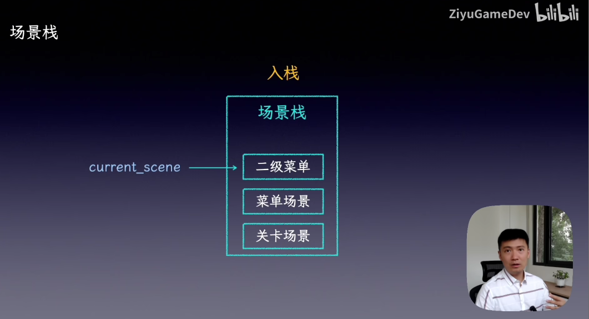

**出栈**

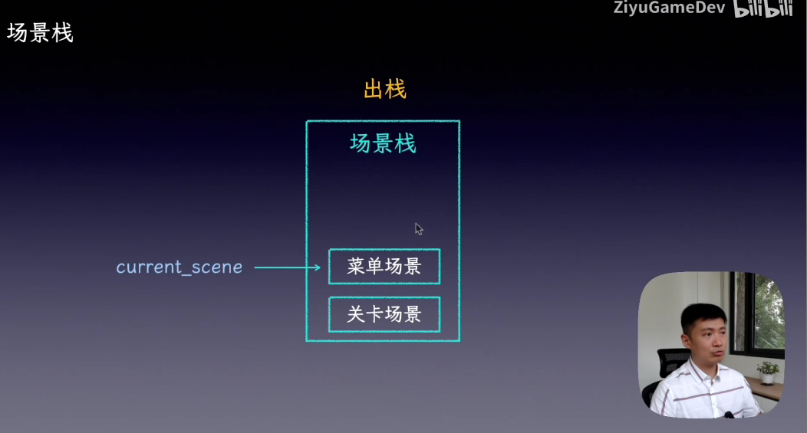

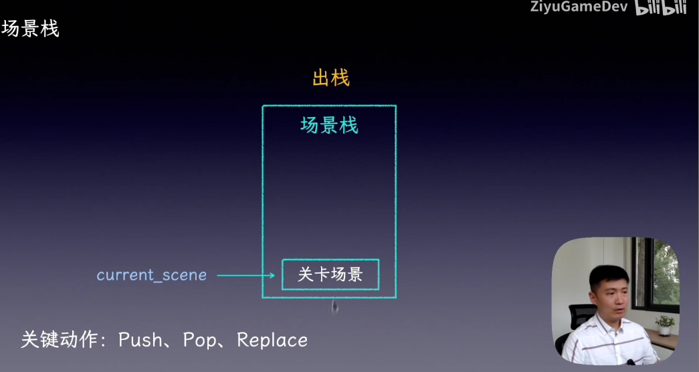

Push、Pop、Replace应该设置为**延时执行**


## erase-remove移除法

比如**普通指针和智能指针就不可以比较**，不能用这个方法来移除

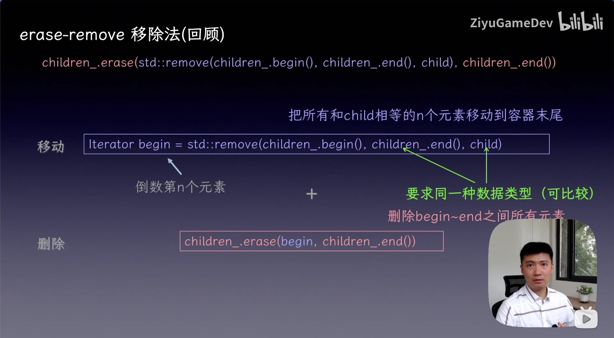

但是可以**用lambda表达式自定义比较规则**

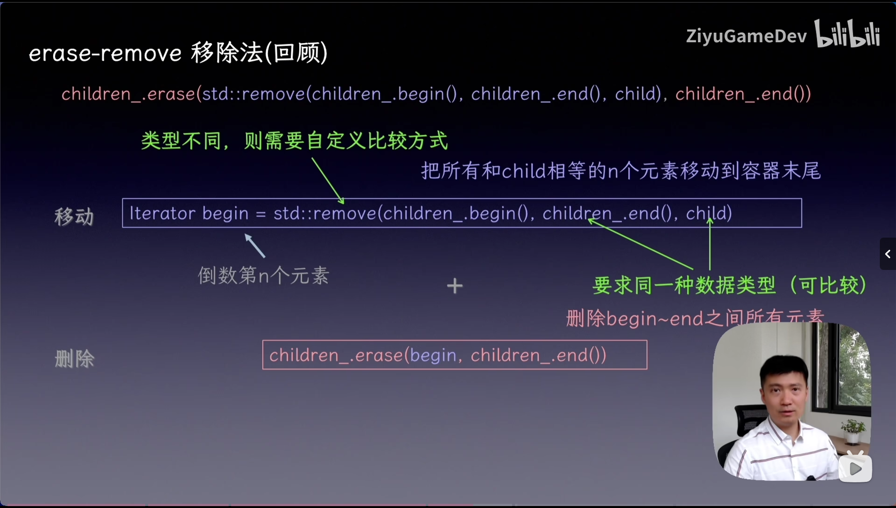

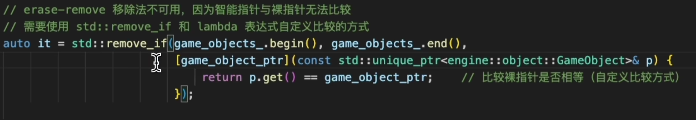


## lambda表达式(匿名函数)

**格式：**[](){}


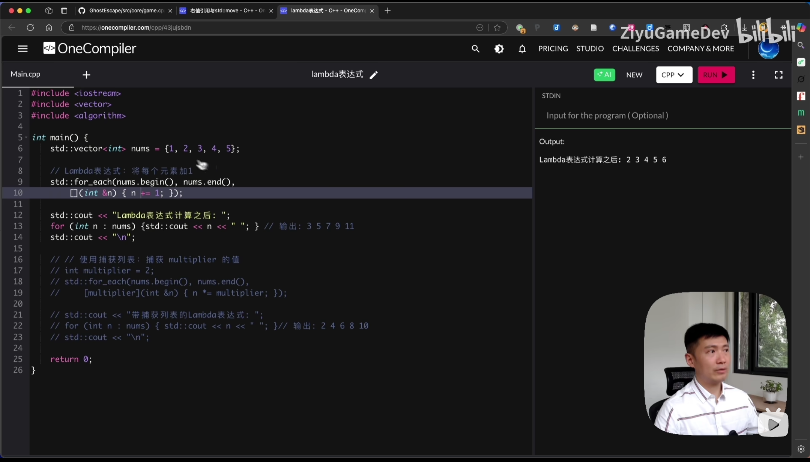

**lambda的捕获列表**

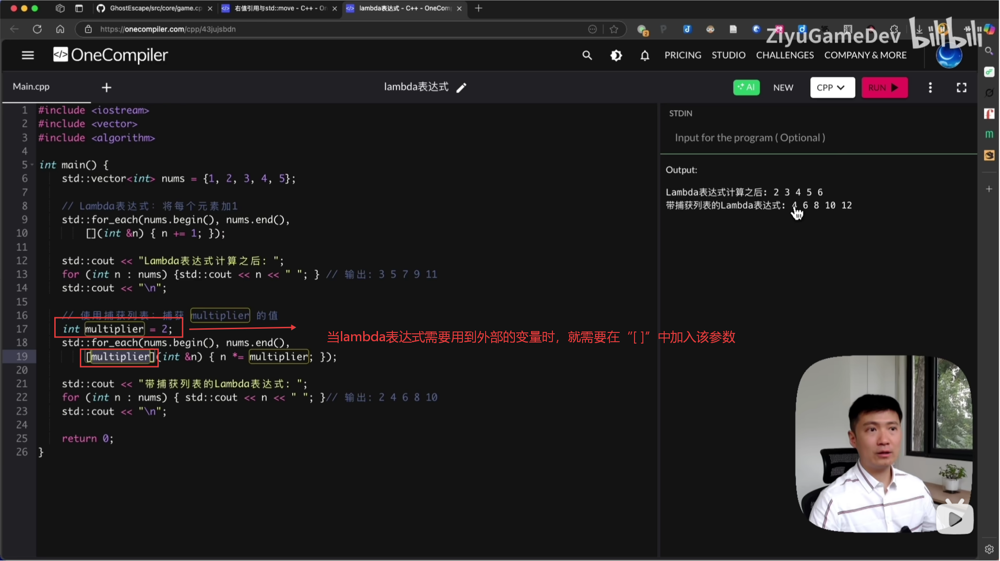

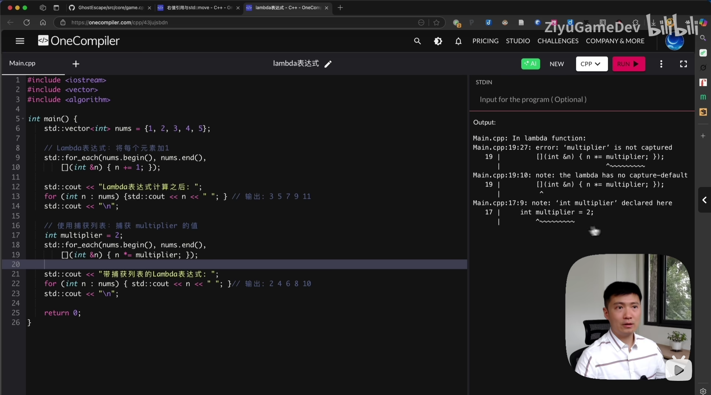


## **C++中指针与引用的使用场景选择指南**

在C++中，指针和引用都是重要的间接访问机制，但它们在使用场景上有明显区别。根据知识库信息，我为您整理了以下选择指南：

### **🛠️ 优先使用引用的场景**

**1. 函数参数传递（大型对象）**

- **为什么**：避免拷贝大对象（如vector、string）的性能开销

- **示例**：

  ```c++
  // 优先使用引用，避免拷贝
  void process(const std::vector<int>& data) {
      // 直接操作data，无需拷贝
  }
  ```

**2. 需要修改外部变量**

- **为什么**：引用更安全、语法更简洁，无需解引用

- **示例**：

  ```c++
  // 用引用更安全直观
  void swap(int& a, int& b) {
      int temp = a;
      a = b;
      b = temp;
  }
  ```

**3. 作为函数返回值**

- **为什么**：返回变量别名，避免返回临时拷贝

- **示例**：

  ```c++
  int& getCounter() {
      static int count = 0;
      count++;
      return count; // 返回count的别名
  }
  ```

**4. 操作符重载**

- **为什么**：使语法更自然，符合C++设计哲学

- **示例**：

  ```c++
  class MyClass {
  public:
      MyClass& operator=(const MyClass& other) {
          // 实现赋值操作
          return *this;
      }
  };
  ```

### **⚠️ 需要使用指针的场景**

**1. 表示"可能不存在"的对象**

- **为什么**：指针可以为nullptr，引用必须绑定有效对象

- **示例**：

  ```c++
  // 指针可以表示"没有对象"
  void processObject(MyClass* obj) {
      if (obj) { // 必须检查是否为空
          obj->doSomething();
      }
  }
  ```

#### **2. 动态内存管理**

- **为什么**：指针是管理堆内存的必要工具

- **示例**：

  ```c++
  // 创建和销毁动态分配的内存
  MyClass* createObject() {
      return new MyClass();
  }
  
  void destroyObject(MyClass* obj) {
      delete obj;
  }
  ```

#### **3. 实现数据结构**

- **为什么**：链表、树等需要动态链接，指针提供灵活性

- **示例**：

  ```c++
  struct Node {
      int value;
      Node* next; // 指针用于链接节点
  };
  ```

#### **4. 多态性**

- **为什么**：基类指针可以指向派生类对象

- **示例**：

  ```c++
  class Base { /* ... */ };
  class Derived : public Base { /* ... */ };
  
  void process(Base* base) {
      base->doSomething(); // 多态调用
  }
  ```

### **📊 关键对比总结**

| 特性               | 引用                 | 指针                 |
| :----------------- | :------------------- | :------------------- |
| **是否可为空**     | ❌ 不能为nullptr      | ✅ 可以为nullptr      |
| **是否可重新绑定** | ❌ 不能重新绑定       | ✅ 可以重新指向       |
| **初始化要求**     | ✅ 必须初始化         | ❌ 可以不初始化       |
| **语法复杂度**     | ✅ 简洁直观（无需*）  | ❌ 需要*和&操作符     |
| **安全性**         | ✅ 更高（避免空引用） | ❌ 较低（野指针风险） |
| **内存占用**       | ✅ 通常不额外占用     | ❌ 需要存储地址       |

### **💡 实用建议**

1. **"能用引用就用引用，需要指针特性时再用指针"** - 这是C++社区的普遍原则
2. **对于函数参数**：
   - 传递大型对象 → 用`const &`
   - 需要修改参数 → 用`&`
   - 可能为空 → 用`*`
3. **对于返回值**：
   - 需要返回对象 → 用`&`（避免拷贝）
   - 返回动态分配内存 → 用`*`
4. **在类成员中**：
   - 如果需要绑定后不可变 → 用`&`
   - 如果需要动态管理 → 用`*`

记住：**引用是"变量的别名"，指针是"存储地址的变量"**。理解这个本质区别，就能在C++编程中正确选择使用哪种工具。

> "指针强大但危险，引用安全但受限。选对工具，代码自然清晰可靠。" —— C++编程核心原则


## **C++中const与非const成员函数的返回值区别**

您提供的两个函数声明是C++中非常常见的**const正确性**实现方式。它们的区别非常关键，让我为您详细解释：

### **1. 两种函数的区别**

#### **非const版本**

```c++
std::vector<std::unique_ptr<engine::object::GameObject>>& getGameObjects() { 
    return game_objects_; 
}
```

- **返回类型**：`std::vector<std::unique_ptr<engine::object::GameObject>>&`（可修改的向量引用）
- **成员函数类型**：非const成员函数
- **作用**：允许调用者修改返回的向量（可以添加、删除或修改向量中的元素）

#### **const版本**

```c++
const std::vector<std::unique_ptr<engine::object::GameObject>>& getGameObjects() const { 
    return game_objects_; 
}
```

- **返回类型**：`const std::vector<std::unique_ptr<engine::object::GameObject>>&`（只读的向量引用）
- **成员函数类型**：const成员函数
- **作用**：只允许调用者读取返回的向量，不能修改它

### **2. 调用时如何区分**

调用时根据**对象的const属性**来决定调用哪个版本：

#### **非const对象调用（可以调用两个版本）**

```cpp
Scene scene; // 非const对象

// 1. 调用非const版本 - 允许修改
auto& gameObjects = scene.getGameObjects();
gameObjects.push_back(std::make_unique<engine::object::GameObject>()); // 可以修改

// 2. 调用const版本 - 只能读取
const auto& gameObjectsConst = scene.getGameObjects();
// gameObjectsConst.push_back(...); // 错误：不能修改const对象
```

#### **const对象调用（只能调用const版本）**

```c++
const Scene scene; // const对象

// 只能调用const版本
const auto& gameObjects = scene.getGameObjects();
// gameObjects.push_back(...); // 错误：不能修改const对象
```

### **3. 为什么需要这两种版本？**

这是C++中**const正确性**（const-correctness）的重要实践：

- **非const版本**：当需要修改场景中的游戏对象时使用
- **const版本**：当只需要读取游戏对象列表，不需要修改时使用

这符合C++的核心原则：**只在需要时允许修改**，避免意外修改。

### **4. 为什么返回引用而不是值？**

从知识库[1]和[7]中可以看到：

> 引用本质是已存在变量的别名，其核心功能是为变量提供另一个名称，所有操作直接作用于原变量。

> 引用不是新定义一个变量，而是给已存在变量取了一个别名，编译器不会为引用变量开辟内存空间，它和它引用的变量共用同一块内存空间。

返回引用（而不是值）可以：

- 避免不必要的拷贝（`std::vector`可能很大）
- 允许调用者直接操作原对象
- 保持与实际数据的一致性

### **5. 为什么使用const引用？**

从知识库[9]和[10]中：

> 引用更适合函数参数传递、避免拷贝大对象、运算符重载等场景。

> 作为函数参数时更直观，不需要解引用

返回`const std::vector<...>&`是C++中处理大型对象返回的标准做法，特别是在需要避免拷贝开销的场景。

### **总结**

表格


| 特性     | 非const版本               | const版本                         |
| :------- | :------------------------ | :-------------------------------- |
| 函数类型 | 非const成员函数           | const成员函数                     |
| 返回类型 | `std::vector<...>&`       | `const std::vector<...>&`         |
| 可修改性 | 调用者可以修改返回的向量  | 调用者不能修改返回的向量          |
| 适用场景 | 对象非const，需要修改向量 | 对象可以是const，或不需要修改向量 |

这种设计是C++中"const正确性"的典型应用，确保了代码的安全性和清晰性。正如知识库[2]中所述："引用更安全、更方便；指针更灵活，但也更容易出错。"


## **智能指针自动释放内存的条件**

根据知识库信息，智能指针会在以下几种情况下自动释放内存：

### **1. 超出作用域**

- 当智能指针对象超出其作用域时，其析构函数会被调用
- 析构函数会检查引用计数，如果引用计数为0，则释放所管理的内存
- 这是RAII（Resource Acquisition Is Initialization）机制的核心原理

### **2. 显式销毁**

- 使用`reset()`方法显式销毁智能指针
- 调用`reset()`时，智能指针会检查引用计数，如果引用计数为0，则释放所管理的内存

### **3. 引用计数为0**

- 对于`std::shared_ptr`，当最后一个拥有该对象的智能指针被销毁或重置时，引用计数会减为0
- 此时智能指针会自动释放所管理的内存
- 从知识库[3]中："引用计数为0：对于std::shared_ptr，当最后一个拥有该对象的智能指针被销毁或重置时，引用计数会减为0，此时智能指针会释放所管理的内存。"

### **4. 智能指针被重新赋值**

- 当智能指针被重新赋值时，原指针会先减少引用计数
- 如果引用计数减至0，原指针会释放所管理的内存
- 从知识库[8]中："对一个对象进行赋值时，赋值操作符减少左操作数所指对象的引用计数（如果引用计数为减至0，则删除对象），并增加右操作数所指对象的引用计数"

### **5. 从容器中移除**

- 当智能指针从容器（如`std::vector`、`std::list`）中被移除时（例如通过`erase`方法）
- 容器中存储的智能指针对象会被销毁
- 如果它是最后一个持有该资源的智能指针，资源会被自动释放

### **6. 独占所有权转移**

- 对于`std::unique_ptr`，当所有权通过移动语义转移时
- 原指针自动置空，新的指针获得所有权
- 当新的指针超出作用域时，会释放内存

### **7. 智能指针对象被销毁**

- 无论哪种智能指针，当其对象被销毁时（如函数返回、作用域结束等）
- 如果它是最后一个持有该资源的智能指针，会自动释放内存

### **重要区别**

- **`std::unique_ptr`**：当唯一所有者被销毁时，自动释放内存
- **`std::shared_ptr`**：当引用计数为0时，自动释放内存
- **`std::weak_ptr`**：不会释放内存，仅作为观察者

### **为什么智能指针能自动管理内存？**

智能指针通过RAII机制，将动态内存的生存期与对象生命周期绑定。当智能指针对象被创建时，它获得对动态内存的所有权；当对象离开作用域时，析构函数会自动释放托管的内存。

如知识库[1]所述："智能指针是C++中用于自动化资源管理的工具，其核心原理是通过对象生命周期来管理动态分配的内存。它基于RAII（Resource Acquisition Is Initialization）理念，在构造时获取资源，在析构时自动释放资源，从而避免内存泄漏。"

智能指针的设计确保了资源在适当的时候被释放，无需手动调用`delete`，从而避免了内存泄漏和悬空指针问题。


## 容器两种遍历方式的比较

### **第一种**

```c++
for (auto it = game_objects_.begin();it != game_objects_.end();)
        {
            if (*it && !(*it)->isNeedRemove())// 正常更新游戏对象
            {
                (*it)->update(delta_time, context_);
                ++it;
            }
            else
            {
                if (*it)// 安全删除需要移除的对象
                {
                    (*it)->clean();
                }
                it = game_objects_.erase(it);// 删除需要移除的对象，智能指针自动管理内存
            }
        }
```

### 第二种

```c++
void Scene::render()
    {
        if (!is_initialized_) return;

        for (const auto& obj : game_objects_)
        {
            if (obj) obj->render(context_);
        }
    }
```

## 区别

| `for (auto it = game_objects_.begin(); ...)` → `it` 是 **迭代器** | `for (auto& it : game_objects_)` → `it` 是 **智能指针的引用** |
| ------------------------------------------------------------ | ------------------------------------------------------------ |
| `++it`：递增迭代器（合法）                                   | `++it`：尝试递增智能指针（非法）                             |
| `it = game_objects_.erase(it)`： → 传递迭代器，接收新迭代器（合法） | `it = game_objects_.erase(it)`： → 传递智能指针（非法），赋值给智能指针（逻辑错误） |

当使用**for (const auto& obj : game_objects_)**时，无法对game_object_  进行**it = game_objects_.erase(it);**   操作。


## **直接返回智能指针与返回智能指针的get()函数结果的区别**

### **1. 直接返回智能指针**

```c++
std::unique_ptr<MyClass> createObject() {
    return std::make_unique<MyClass>();
}
```

**特点**：

- 返回的是智能指针对象本身（如`std::unique_ptr<MyClass>`）
- 智能指针管理对象的生命周期，确保对象在智能指针超出作用域时自动释放
- 调用者可以继续使用智能指针的所有功能（如`->`、`*`操作符，`reset()`等）
- 保持了内存管理的安全性

### **2. 返回智能指针的get()函数结果**

```c++
MyClass* createObject() {
    auto ptr = std::make_unique<MyClass>();
    return ptr.get(); // 返回裸指针
}
```

**特点**：

- 返回的是裸指针（如`MyClass*`）
- 智能指针仍然拥有对象的所有权，但裸指针只是指向这个对象
- 调用者不能使用智能指针的功能，只能通过裸指针访问对象
- **危险**：如果调用者在智能指针生命周期结束后继续使用这个裸指针，会导致悬空指针（dangling pointer）问题

### **关键区别**

表格


| 特性     | 直接返回智能指针         | 返回get()结果                                                |
| :------- | :----------------------- | :----------------------------------------------------------- |
| 返回类型 | 智能指针对象             | 裸指针                                                       |
| 内存管理 | 由智能指针自动管理       | 智能指针仍管理内存，但调用者无法知道                         |
| 安全性   | 高，不会导致悬空指针     | 低，容易导致悬空指针                                         |
| 使用限制 | 可以使用智能指针所有功能 | 只能使用裸指针访问对象                                       |
| 典型错误 | 无                       | 从知识库[3]和[7]的例子中可见：`int* q = p.get();` 在`p`析构后，`q`成为悬空指针 |

### **为什么不应该返回get()结果**

从知识库[3]和[7]的示例可以清楚看到问题：

```c++
int* q = new int(9); 
{ 
    std::shared_ptr<int> p(new int(10)); 
    ... 
    q = p.get(); 
} 
std::cout << *q << std::endl; // 这里q是悬空指针！
```

在上述代码中，`p`在作用域结束时被析构，会释放`int(10)`对象，但`q`仍然指向这个已释放的内存，导致未定义行为。

### **正确做法**

**应直接返回智能指针**，而不是返回get()结果。如果需要将对象传递给不支持智能指针的代码，可以这样做：

```c++
void LegacyFunction(MyClass* obj); // 不支持智能指针的函数

void SafeUsage() {
    auto ptr = std::make_unique<MyClass>();
    // 通过get()传递裸指针，但确保在ptr生命周期内使用
    LegacyFunction(ptr.get());
    // ptr在作用域结束时自动释放对象
}
```

**重要提醒**：从知识库[10]中明确指出："不能对使用get()返回的指针使用delete操作，因为智能指针会自动管理对象的生命周期。同时，也不应该将另一个智能指针与get()返回的指针绑定在一起，这样的操作是错误的。"

总结：直接返回智能指针是安全且推荐的做法，而返回get()结果会破坏智能指针的内存管理机制，容易导致悬空指针问题。


# 12 关卡载入器（图片层）

## 可以处理文件路径的函数

```c++
#include <filesystem>

/**
     * @brief 解析图片路径，合并地图路径和相对路径。例如：
     * 1. 地图路径："assets/maps/level1.tmj"
     * 2. 相对路径："../textures/Layers/back.png"
     * 3. 最终路径："assets/textures/Layers/back.png"
     * @param image_path （图片）相对路径
     * @return std::string 解析后的完整路径。
     */
std::string LevelLoader::resolvePath(std::string image_path)
{
    try {   
    // 获取地图文件的父目录（相对于可执行文件） “assets/maps/level1.tmj” -> “assets/maps”
    auto map_dir = std::filesystem::path(map_path_).parent_path();
    // 合并路径（相对于可执行文件）并返回。 /* std::filesystem::canonical：解析路径中的当前目录（.）和上级目录（..）导航符，
                                      /*  得到一个干净的路径 */
    auto final_path = std::filesystem::canonical(map_dir / image_path);
    return final_path.string();
    } catch (const std::exception& e) {
        spdlog::error("解析路径失败: {}", e.what());
        return image_path;
    }
}
```


# 13关卡载入器（瓦片层）

## 瓦片索引的处理

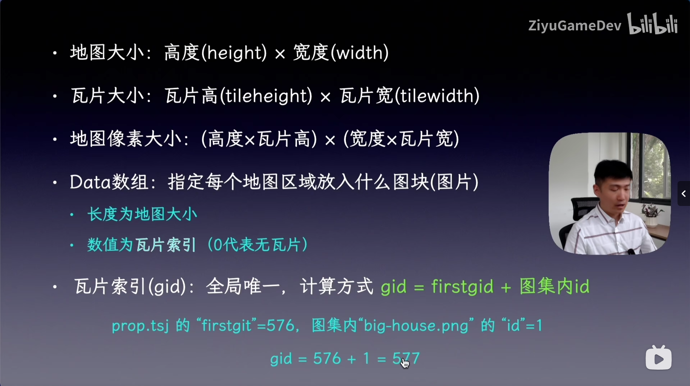

## size_t

**size_t是C++中用于表示对象大小或内存相关数量的无符号整数类型，定义于等头文件中，实际为unsigned long或类似类型的别名，其大小在32位系统上通常为4字节，在64位系统上通常为8字节，专为跨平台内存计算设计。**

### **1. size_t的本质与来源**

**size_t**是C++标准库中定义的关键无符号整数类型，主要用于表示对象大小、内存字节数和数组索引等。它并非C++语言内置的基本类型，而是通过`typedef`在标准头文件中定义的别名：

- **定义位置**：主要在`<cstddef>`、`<cstdio>`、`<cstdlib>`等头文件中定义
- **历史渊源**：源自C语言的`stddef.h`头文件，C++继承并广泛使用
- **全称含义**：size type，即"用于记录大小的数据类型"2

### **2. size_t的平台依赖性与大小**

size_t的核心优势在于其**平台自适应性**，能根据系统架构自动调整大小：

- **32位系统**：通常为`unsigned int`类型，**4字节**大小，取值范围0～4,294,967,295
- **64位系统**：通常为`unsigned long`或`unsigned long long`类型，**8字节**大小，取值范围0～18,446,744,073,709,551,61513

这种设计确保了size_t能**足够大以存储内存中任意对象的大小**，无论是在32位还是64位系统上都能正确表示最大可能的内存地址空间3。

### **3. 为什么使用size_t而非int或unsigned int**

使用size_t而非固定整数类型具有显著优势：

- **跨平台可移植性**：代码在不同架构间移植时，size_t会自动调整为适合当前平台的大小，无需修改代码
- **避免类型不匹配**：与sizeof操作符返回类型一致，避免编译警告或错误
- **安全性**：无符号特性防止了负大小或负索引的出现，减少了逻辑错误
- **标准库一致性**：与C++标准库保持高度一致，避免类型转换带来的问题1

### **4. 常见使用场景**

size_t在C++标准库和系统编程中频繁出现：

- **sizeof操作符**：`size_t size = sizeof(int);` // 正确且安全的方式
- **标准库容器**：`std::vector::size()`、`std::string::size()`等方法返回size_t类型
- **内存分配**：`malloc(n * sizeof(T))`中n推荐使用size_t类型
- **字符串处理**：`strlen()`、`memcpy()`等C风格函数接受size_t参数
- **数组索引**：使用size_t可避免负数下标问题14

### **5. 使用注意事项与陷阱**

尽管size_t有很多优点，但使用时需注意以下问题：

- **无符号整数陷阱**：当size_t与有符号整数混合运算时，有符号整数会被提升为无符号类型，可能导致意外结果

  ```c++
  size_t n = 10;
  int i = -1;
  if (i < n) { /* 可能评估为false，因为-1被转换为极大正数 */ }
  ```

- **循环边界问题**：逆序遍历时需特别小心

  ```c++
  // 错误写法：会导致无限循环
  for (size_t i = n-1; i >= 0; --i) { /* ... */ }
  
  // 正确写法
  for (size_t i = n; i-- > 0;) { /* ... */ }
  ```

- **打印输出**：使用printf系列函数时应使用`%zu`格式说明符；在C++中直接使用`std::cout`输出更安全111

### **6. size_t与其他相关类型**

- **ptrdiff_t**：有符号整数类型，用于存储两个指针相减的结果，表示指针间的距离
- **size_type**：STL容器中定义的与size_t类似的类型，通常就是size_t的别名
- **ssize_t**：有符号版本的size_t，用于表示可执行读写操作的数据块大小2

### **总结**

**size_t是C++实现平台无关内存计算的关键类型**，理解其用途有助于写出更健壮、可移植的代码。在处理对象大小、数组索引、内存分配等场景时，应优先使用size_t而非int或unsigned int，以确保代码在不同平台上的正确性和安全性。同时，需注意其无符号特性可能带来的运算陷阱，避免与有符号类型混用导致逻辑错误。


## 两种初始化方式的对比：

#### 1.圆括号初始化（传统方式）

```c++
engine::render::Sprite sprite(texture_id, texture_rect);
```

- C++98/03的传统方式
- 直接调用构造函数
- 可能会与函数声明产生歧义

#### 2. 花括号初始化（C++11引入）

```c++
engine::render::Sprite sprite{ texture_id, texture_rect };
```

- C++11引入的统一初始化语法
- 更现代、更安全的初始化方式

### 主要区别：

#### 安全性优势：

```c++
// 花括号初始化防止窄化转换（编译器报错）
int x = 5.7;      // 编译通过，x=5（丢失精度）
int y{5.7};       // 编译错误！阻止窄化转换
```

#### 避免歧义：

```c++
// 最令人烦恼的解析问题（most vexing parse）
Widget w();        // 被解析为函数声明，不是对象！
Widget w{};        // 明确是对象初始化
Widget w;          // 默认构造，没有歧义
```

#### 初始化列表构造函数优先：

```c++
class Vector {
public:
    Vector(int size) { /* 分配内存 */ }
    Vector(std::initializer_list<int> list) { /* 使用初始化列表 */ }
};

Vector v1(5);      // 调用第一个构造函数，size=5
Vector v2{5};      // 调用第二个构造函数，列表包含一个元素5
```

#### 聚合初始化：

```c++
struct Point {
    int x, y;
};

Point p1(1, 2);    // 错误：不是类类型
Point p2{1, 2};    // 正确：聚合初始化
```


### 推荐使用花括号初始化的情况：

1. **现代C++代码**（C++11及以上）

2. **避免窄化转换**

3. **初始化容器**

   ```c++
   std::vector<int> v{1, 2, 3, 4, 5};
   ```

   

4. **类成员初始化**

   ```c++
   class MyClass {
       std::vector<int> data{1, 2, 3};  // 成员初始化
   };
   ```

   

### 需要注意的例外情况：

```c++
// auto推导类型时的区别
auto x{42};      // C++11: std::initializer_list<int>
auto y = {42};   // std::initializer_list<int>
auto z(42);      // int

// 但在C++17中，auto x{42} 推导为 int
```

在游戏开发中，两种方式都可能见到。**花括号初始化**更安全、更现代，是现代C++的推荐做法，特别是在引擎开发中，可以避免很多潜在的bug


## SDL细节

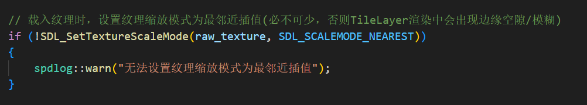


# 15物理引擎和物理组件

## 直接循环 + erase  和  remove+erase的区别

### 场景设置

假设我们有：

```c++
vector<int> nums = {1, 2, 3, 2, 4, 2, 5};
// 删除所有值为2的元素
```


### 方法1：直接循环 + erase

#### 执行过程（一步步走）

```c++
for (auto it = nums.begin(); it != nums.end(); ) {
    if (*it == 2) {
        it = nums.erase(it);  // 这里发生了很多事情！
    } else {
        ++it;
    }
}
```


**第一次循环**：

```
初始: nums = [1, 2, 3, 2, 4, 2, 5], it指向1
*it=1不是2，++it
现在it指向2（索引1）
```


**第二次循环**：

```
nums = [1, 2, 3, 2, 4, 2, 5], it指向索引1的2
*it==2，执行erase(it)

发生了什么：
1. 删除索引1的元素（值为2）
2. 后面的所有元素必须向前移动一位！
   [1, 3, 2, 4, 2, 5]
   ↑  ↑  ↑  ↑  ↑
   (3移到索引1，2移到索引2，4移到索引3...)
3. erase返回指向索引1的迭代器（现在值是3）

现在nums = [1, 3, 2, 4, 2, 5]
it指向索引1（值为3）
```


**第三次循环**：

```
nums = [1, 3, 2, 4, 2, 5], it指向索引1的3
*it=3不是2，++it
现在it指向索引2（值为2）
```


**第四次循环**：

```
nums = [1, 3, 2, 4, 2, 5], it指向索引2的2
*it==2，执行erase(it)

发生了什么：
1. 删除索引2的元素（值为2）
2. 后面的所有元素再次向前移动！
   [1, 3, 4, 2, 5]
   ↑  ↑  ↑  ↑  ↑
   (4移到索引2，2移到索引3...)
3. erase返回指向索引2的迭代器（现在值是4）

现在nums = [1, 3, 4, 2, 5]
it指向索引2（值为4）
```


**第五次循环**：

```
nums = [1, 3, 4, 2, 5], it指向索引2的4
*it=4不是2，++it
现在it指向索引3（值为2）
```


**第六次循环**：

```
nums = [1, 3, 4, 2, 5], it指向索引3的2
*it==2，执行erase(it)

发生了什么：
1. 删除索引3的元素（值为2）
2. 后面的所有元素再次向前移动！
   [1, 3, 4, 5]
3. erase返回指向索引3的迭代器（现在值是5）

现在nums = [1, 3, 4, 5]
it指向索引3（值为5）
```


**第七次循环**：

```
nums = [1, 3, 4, 5], it指向索引3的5
*it=5不是2，++it
it == nums.end()，循环结束
```


**总结问题**：

- 每次删除都要把后面所有元素向前移动一次
- 总共移动了多少次？
  - 第一次删除：移动了5个元素（3,2,4,2,5）
  - 第二次删除：移动了3个元素（4,2,5）
  - 第三次删除：移动了1个元素（5）
  - **总共移动了9次！**
- 时间复杂度：O(n²)

### 方法2：remove + erase

#### 执行过程（一步步走）

```
// remove是算法，不理解可以想象成有两个指针：读指针和写指针
auto it = remove(nums.begin(), nums.end(), 2);
nums.erase(it, nums.end());
```


**初始状态**：

```
nums = [1, 2, 3, 2, 4, 2, 5]
读指针 = 开始位置（索引0，值1）
写指针 = 开始位置（索引0，值1）
```


**第一步**：

```tex
读指针指向1，不是2
把读指针的值复制到写指针的位置（1复制到索引0）
移动读指针和写指针

当前：nums = [1, 2, 3, 2, 4, 2, 5]
读指针指向索引1（值2），写指针指向索引1（值2）
```


**第二步**：

```tex
读指针指向2，是要删除的
只移动读指针，写指针不动！

当前：nums = [1, 2, 3, 2, 4, 2, 5]
读指针指向索引2（值3），写指针指向索引1（值2）
```


**第三步**：

```tex
读指针指向3，不是2
把读指针的值复制到写指针的位置（3复制到索引1）
移动读指针和写指针

当前：nums = [1, 3, 3, 2, 4, 2, 5]  // 注意：索引2的3还在
读指针指向索引3（值2），写指针指向索引2（值3）
```


**第四步**：

```tex
读指针指向2，是要删除的
只移动读指针

当前：读指针指向索引4（值4），写指针指向索引2（值3）
```


**第五步**：

```tex
读指针指向4，不是2
把读指针的值复制到写指针的位置（4复制到索引2）
移动读指针和写指针

当前：nums = [1, 3, 4, 2, 4, 2, 5]
读指针指向索引5（值2），写指针指向索引3（值2）
```


**第六步** 

```tex
读指针指向2，是要删除的
只移动读指针

当前：读指针指向索引6（值5），写指针指向索引3（值2）
```


**第七步**：

```tex
读指针指向5，不是2
把读指针的值复制到写指针的位置（5复制到索引3）
移动读指针和写指针

当前：nums = [1, 3, 4, 5, 4, 2, 5]
读指针指向end()，写指针指向索引4（值4）
```


**remove完成**：

```tex
remove返回写指针的位置（索引4）
现在nums的内容是：[1, 3, 4, 5, 4, 2, 5]
              有效部分↑     无效部分↑
```


**执行erase**：

```tex
nums.erase(it, nums.end());
删除从索引4到结尾的所有元素

最终结果：nums = [1, 3, 4, 5]
```


**总结优势**：

- 每个元素只被检查一次
- 每个需要保留的元素最多被移动（复制）一次
- **总共移动了4次**（1, 3, 4, 5各一次）
- 时间复杂度：O(n)

### 可视化对比

```tex
方法1：循环erase（推箱子游戏，每次都要把所有箱子往前推）
[1, 2, 3, 2, 4, 2, 5]   删除第一个2
 ↓
[1, 3, 2, 4, 2, 5]      后面的5个元素都移动了！
      ↓
[1, 3, 4, 2, 5]         后面的3个元素都移动了！
         ↓
[1, 3, 4, 5]            后面的1个元素移动了

方法2：remove+erase（传送带，只拿需要的）
[1, 2, 3, 2, 4, 2, 5]
 需要√ ×  √  ×  √  ×  √  // 标记需要保留的
 ↓↓↓↓↓↓↓
[1, 3, 4, 5, ?, ?, ?]     // 一次整理好
      有效↑   无效↑
删除无效部分
[1, 3, 4, 5]
```


### 核心区别总结

| 操作           | 循环erase                  | remove+erase             |
| :------------- | :------------------------- | :----------------------- |
| **检查次数**   | 每个元素多次检查           | 每个元素检查一次         |
| **移动次数**   | 每次删除都移动后面所有元素 | 每个保留元素最多移动一次 |
| **时间复杂度** | O(n²)                      | O(n)                     |
| **性能**       | 慢，特别是删除多个元素     | 快                       |
| **稳定性**     | 保持顺序                   | 保持顺序                 |

**最简单的理解**：

- `erase`：像是整理书架，每次拿走一本书，就把后面所有书都往前挪
- `remove`：像是整理书包，先把要的书都挑出来放在前面，最后把不要的扔掉


# 16 碰撞器组件和碰撞检测

## 圆形和方形的碰撞检测

**检测圆形到矩形的最邻近点是否在圆形内部**

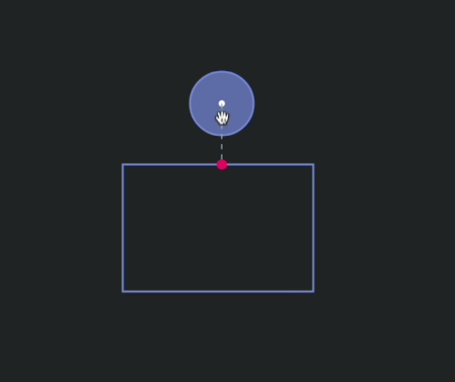

**算法实现：**

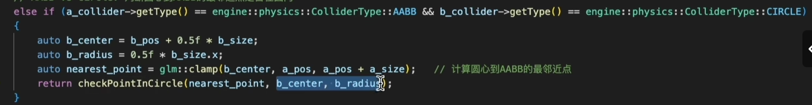


# 17瓦片地图碰撞解析

## 对瓦片进行碰撞检测时分开考虑物体的x和y两个方向

**而不是一起考虑**

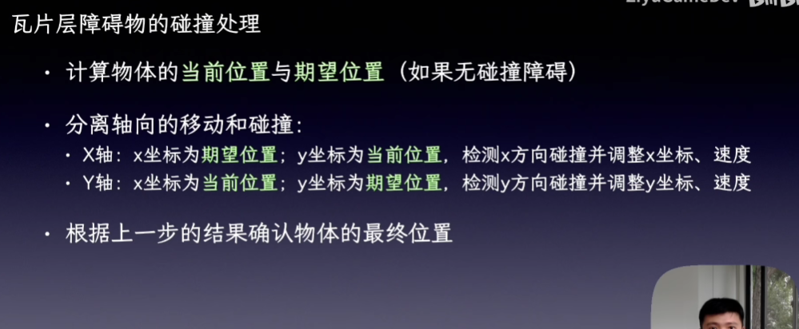


## 检测是否碰撞的方法

**角点坐标：就是碰撞盒四个角的坐标**

**向下移动时就检测下边两个点，像右移动就检测右边两个点，向右下移动就检测两种情况的并集点**

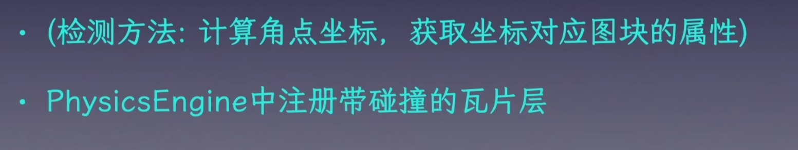


# 19 单向瓦片和斜坡

## ⭐相机的平滑跟随处理

**参考camera.h以及camera.cpp**

```c++
void Camera::update(float delta_time)
{
    if (target_ == nullptr)  return;
    glm::vec2 target_pos = target_->getPosition();
    glm::vec2 desired_position = target_pos - viewport_size_ / 2.0f;      // 计算目标位置 (让目标位于视口中心)

    // 计算当前位置与目标位置的距离
    auto distance_ = glm::distance(position_, desired_position);
    constexpr float SNAP_THRESHOLD = 1.0f; // 设置一个距离阈值  (constexpr: 编译时常量，避免每次调用都计算)

    if (distance_ < SNAP_THRESHOLD) {
        // 如果距离小于阈值，直接吸附到目标位置
        position_ = desired_position;
    } else {
        // 否则，使用线性插值平滑移动   glm::mix(a,b,t): 在向量 a 和 b 之间进行插值，t 是插值因子，范围在0到1之间。
                                 // 公式: (b-a)*t + a;   t = 0 时结果为 a，t = 1 时结果为 b
        						 // 所以当b和a相差越小时，得到的结果就越小，反之则越大
        						 // 应用到相机上则可以让相机在离物体近的时候移动的慢，反之则快
        position_ = glm::mix(position_, desired_position, smooth_speed_ * delta_time);
        position_ = glm::vec2(glm::round(position_.x), glm::round(position_.y));    // 四舍五入到整数,省略的话偶尔会出现画面割裂
    }

    clampPosition();
}
```


# 20 玩家组件与状态机

## 初始化列表的使用

```c++
#pragma once
#include "player_state.h"

namespace game::component::state {

class WalkState final : public PlayerState {
    friend class game::component::PlayerComponent;
public:
    WalkState(PlayerComponent* player_component) : PlayerState(player_component) {}
    ~WalkState() override = default;

private:
    void enter() override;
    void exit() override;
    std::unique_ptr<PlayerState> handleInput(engine::core::Context&) override;
    std::unique_ptr<PlayerState> update(float delta_time, engine::core::Context&) override;
};

//为什么这里的构造函数可以这样写，原理是什么
```

### 1. **初始化列表（Initialization List）**

```c++
WalkState(PlayerComponent* player_component) : PlayerState(player_component) {}
```

- `: PlayerState(player_component)` 是初始化列表
- 在构造函数体执行**之前**，先调用基类 `PlayerState` 的构造函数
- 这种写法是初始化成员变量的推荐方式，比在构造函数体内赋值更高效

### 2. **继承构造函数调用原理**

当创建 `WalkState` 对象时：

```c++
// 假设在 PlayerComponent 中：
auto walk_state = std::make_unique<WalkState>(this);
```

执行顺序：

1. 先调用基类 `PlayerState` 的构造函数
2. 再执行 `WalkState` 构造函数体（这里为空）

### 3. **私有构造函数的原理**

```c++
private:
    WalkState(PlayerComponent* player_component) : PlayerState(player_component) {}
```

虽然构造函数是 `private`，但可以通过以下方式创建对象：

#### **友元类访问**

```c++
friend class game::component::PlayerComponent;
```

- 只有 `PlayerComponent` 类可以创建 `WalkState` 实例
- 这是"工厂模式"的一种简单实现，控制对象创建权限

#### **使用示例**

```c++
// 在 PlayerComponent 类中（友元类）：
std::unique_ptr<PlayerState> PlayerComponent::createWalkState() {
    return std::make_unique<WalkState>(this);  // 可以访问私有构造函数
}

// 在其他类中：
// auto state = WalkState(player);  // 错误！构造函数私有
```

### 4. **设计模式的体现**

这种写法实现了：

- **状态模式**：`WalkState` 是具体状态
- **有限访问**：通过友元和私有构造函数，确保只有 `PlayerComponent` 能创建状态对象
- **资源管理**：使用 `unique_ptr` 自动管理内存

### 5. **完整的等效代码**

如果不使用初始化列表，等效代码会是：

```c++
// 不推荐这样写！
WalkState(PlayerComponent* player_component) {
    // 这里会先调用 PlayerState 的默认构造函数（如果有）
    // 然后再赋值... 效率较低
}
```

这种设计确保了：

1. 状态对象只能由特定的管理者（`PlayerComponent`）创建
2. 基类正确初始化
3. 对象生命周期由智能指针管理
4. 实现了状态模式的封装性
